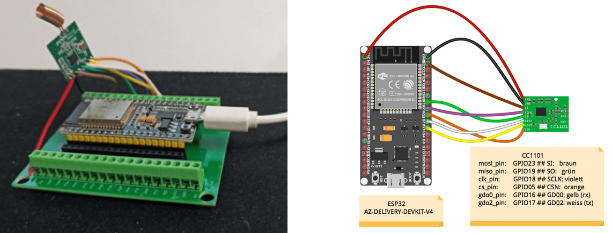
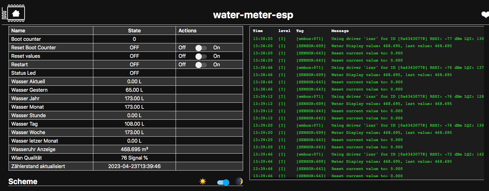
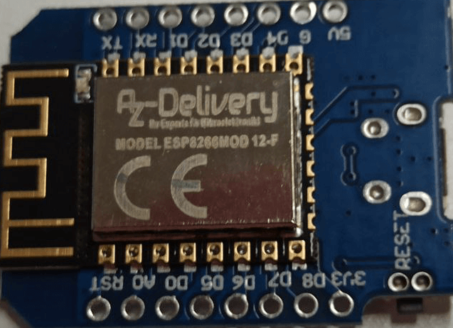
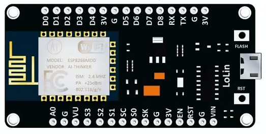
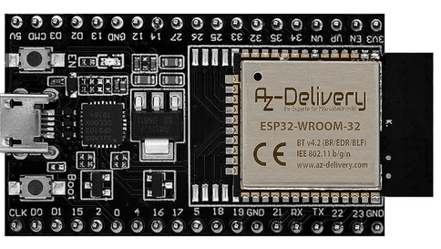

# Easy Watermeter Integration for Home Assistant

[![License][license-shield]][license]

[![ESPHome release][esphome-release-shield]][esphome-release]
[![Open in Visual Studio Code][open-in-vscode-shield]][open-in-vscode]
[![Support author][donate-me-shield]][donate-me]

[license-shield]: https://img.shields.io/static/v1?label=License&message=MIT&color=orange&logo=license
[license]: https://opensource.org/licenses/MIT

[esphome-release-shield]: https://img.shields.io/static/v1?label=ESPHome&message=2023.5.0&color=green&logo=esphome
[esphome-release]: https://GitHub.com/esphome/esphome/releases/

[open-in-vscode-shield]: https://img.shields.io/static/v1?label=+&message=Open+in+VSCode&color=blue&logo=visualstudiocode
[open-in-vscode]: https://open.vscode.dev/zibous/ha-watermeter

[donate-me-shield]: https://img.shields.io/static/v1?label=+&color=orange&message=Buy+me+a+coffee
[donate-me]: https://www.buymeacoff.ee/zibous

 

## Water meter with IZAR module (Diehl IZAR RC 868 I R4 PL)

I did some experiments with **wmbusmeters**, **DVT SDR_STICK**, **NANOCUL** and ended up with: **ESPHome - ESP32 (v4) + CC1101**.

With the NANOCUL solutions, I always had problems with the USB input and with the high resource consumption on the NUC or Raspberry computers.

 

## ESPHome + ESP32 (v4) + CC1101

ESPHome - ESP32 (v4) + CC1101 is the best solution for me because the resource requirement is low.

[+CC1101-orange?style=for-the-badge)](https://github.com/zibous/ha-watermeter/blob/master/esphome/wm-esp32.yaml)

 

## ESP32 (v4) Variante

### Requirements

- Water meter with IZAR module (Diehl IZAR RC 868 I R4 PL),
  IZAR Radio Compact Hall is designed for mobile reading and fixed network remote reading of Diehl Metering meters.
   
- [ ESP32 Dev Kit C V4 NodeMCU](https://amzn.eu/d/eUNLyYc)
- [Fayme CC1101 868MHZ Funk ÜBertragung Antennen Transceiver Modul, Grün](https://amzn.eu/d/i5YwBkR)

### Meter types:

Currently supported meter types (wmbus 2.1.10):

- amiplus
- apator08 
- apator162
- apatoreitn
- bmeters
- compact5
- elf
- evo868
- fhkvdataiii
- hydrocalm3
- hydrus
- iperl
- itron
- **izar**
- mkradio3
- mkradio4
- qheat
- qwater
- sharky774
- topaseskr
- ultrimis
- unismart
- vario451
- ... more will come :)

see: <https://github.com/SzczepanLeon/esphome-components>

## Installation / Details
[ESPHome - ESP32 (v4) + CC1101](./esphome/README.md)

## Result

 

## ESP8266 vs ESP32 (v4)
The version with **WEMOS D1MINI (ESP8266)** was my first version. WEMOS D1MINI (ESP8266) has only limited RAM and can only be used to a limited extent. If there are too many sensors, a **JSON memory error occurs**, which causes the device to restart again and again.

__Note__: The **ESP32** has more RAM memory and is therefore better suited for use.

 

|  Device | Remarks   | Hardware  | 
|---------|-----------|--------|
| **Wemos D1 Mini**  |  CC1101, board: d1_mini   |   ESP8266 80MHz, **80KB RAM**, 4MB Flash |
| **Wemos D1 Mini Board**  |  CC1101, board: esp12e (board: d1_mini )   |  ESP8266 80MHz, **80KB RAM** , 4MB Flash       |
| **NodeMCU Lolin V3 Module**    |  CC1101, board: NodeMCU Lua Lolin V3 Module ESP8266  | ESP8266 80MHz, **80KB RAM** , 4MB Flash      |
| **ESP32 Dev Kit C V4 NodeMCU**    |  CC1101, board: az-delivery-devkit-v4  |  ESP32 240MHz, **520KB RAM**, 4MB Flash     |

 

### Memory Usage D1 Mini

 

## ESPHome Device configurations

- **Testcase - and simple version**
	`Total Water m³ (Watermeter Display)`, `LQI`, `RSSI`, `Total m³`, `Last Month total m³`, `Current Month total liter`, `Remaining Battery Lifetime`, `Last Transmit periode`, `Current Alarm Code`, `Previous Alarm Code`, `Boot Counter`, `WIFI Signal`, `Application Version`.
- **Full version**
	`Total Water m³ (Watermeter Display)`, `LQI`, `RSSI`, `Total m³`, `Last Month total m³`, `Water usage current`, `Water usage hour`, `Water usage today`, `Water usage yesterday`, `Water usage week`, `Water usage month`, `Water usage previous month`, `Water usage current year `, `Remaining Battery Lifetime`, `Last Transmit periode`, `Alarm Text`, `Previous Alarm Text`, `Boot Counter`, `WIFI Signal`, `Reset values`, `Restart`, `Set History value with Homeassistant service`, `Application Version`, `Online Time`, `Watermeter LED`, `Watermeter Timestamp`, `Watermeter Update intervall`.	

 	
	
|  Version         | Remarks   | Configuration  | 
|------------------|-----------|----------------|
| 🛠 WMBUSCHECK  |Test configuration and wmbus. NO SENSORS only messages: Details see Log window  |[wm-check-wmbus.yaml](esphome/wm-check-wmbus.yaml)  |
| 🛠 ESP32 Test  |Frist run to find watermeters. Messages see Log window or syslog messages |[wm-esp32-test.yaml](esphome/wm-esp32-test.yaml)  |
| 💻 ESP32 Simple  |Simple Sensor outputs, no calculations. Low memory consumption.         |[wm-esp32-simple.yaml](esphome/wm-esp32-simple.yaml)  |
|✔️ ESP32  |Full version - Sensors and calulated values, Statitics. Alarmcode text message          |[wm-esp32.yaml](esphome/wm-esp32.yaml)  |  
| D1MINI IZAR WMBUS|Testcase for IZAR WMBUS METER          |[wm-d1mini_izar-wmbus.yaml](esphome/wm-d1mini_izar-wmbus.yaml)|
| 🛠 D1MINI Test|Frist run to find watermeters. Messages see Log window or syslog messages         |[wm-d1mini-test.yaml](esphome/wm-d1mini-test.yaml)|
| 💻 D1MINI Simple |Simple Sensor outputs, no calculations. Low memory consumption.          |[wm-d1mini-simple.yaml](esphome/wm-d1mini-simple.yaml)|
|✔️ D1MINI |Sensors and calulated values, Statitics. Alarmcode text message          |[wm-d1mini.yaml](esphome/wm-d1mini.yaml)|  
| 🛠 NodeMCU Test |Frist run to find watermeters. Low memory consumption. Messages see Log window or syslog messages          |[wm-nodemcu-test.yaml](esphome/wm-nodemcu-test.yaml) |
|✔️ NodeMCU  |Full version - Sensors and calulated values, Statitics. Alarmcode text message|[wm-nodemcu.yaml](esphome/wm-nodemcu.yaml) |  
  
   
  

## Other solutions (alternatively)

- 1. [NANOCUL-DOCKER.md](NANOCUL-DOCKER.md)
- 2. [NANO-CUL.md](NANO-CUL.md)
- 3. [RB3B_DVBT - RTL232-md](RTL232.md)

### For more information see:

- <https://github.com/weetmuts/wmbusmeters>

- <https://github.com/maciekn/izar-wmbus-esp>
- <https://github.com/MariuszWoszczynski/ESPhome-IZAR-meter-reader>

- <https://github.com/SzczepanLeon/esphome-components>

- <https://osmocom.org/projects/rtl-sdr/wiki/Rtl-sdr>
- <https://github.com/xaelsouth/rtl-wmbus>
- <https://github.com/ZeWaren/izar-prios-smart-meter-collector>

#### DVB-T receiver or Nano CUL Adapter
- DVB-T receiver: <https://amzn.eu/d/8AsinRu>

- nano-cul: <https://www.smart-home-komponente.de/nano-cul/nano-cul-868-extra/>

- diehl watermeter: <https://www.diehl.com/metering/en/portfolio/software-system-components/software-system-components-products/software-system-components-product/izar-radio-compact-hall/74843/>

