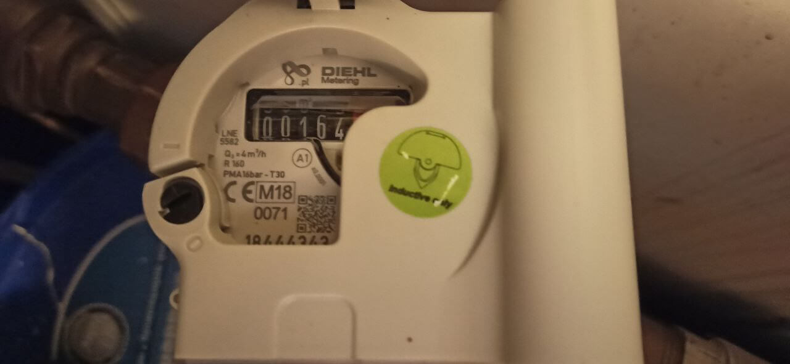
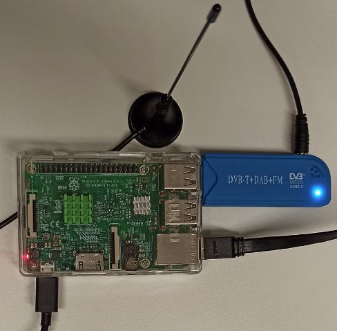
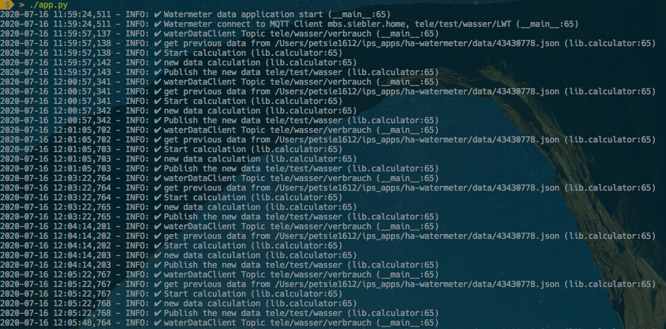
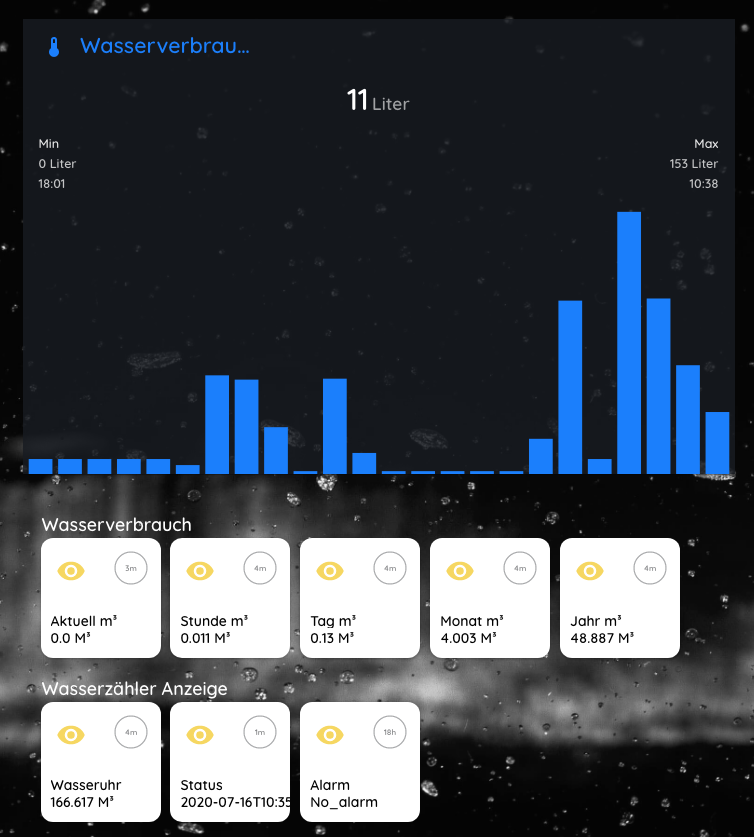

# Easy Watermeter Integration for Home Assistant




### Requirements

- Water meter with IZAR module (Diehl IZAR RC 868 I R4 PL), 
  IZAR Radio Compact Hall is designed for mobile reading and fixed network remote reading of Diehl Metering meters. 
  <br>
- Supported DVB-T receiver or Nano CUL Adapter, 
  Andoer Tragbarer Mini Digitaler TV Stock USB 2.0 DVB-T + DAB + FM + RTL2832U + FC0012 Chip Unterstützung SDR Stimmer Empfänger 
  <br>
- A computer. I’m using Raspbian Buster on a Raspberry Pi 3B+, but any Linux, macOS should work


##  Raspbian Buster  +  DVB-T receiver 

### 


### Install dependencies

You need install:

- `rtl-sdr`
  Turns your Realtek RTL2832 based DVB dongle into a SDR receiver
  https://osmocom.org/projects/rtl-sdr/wiki/Rtl-sdr
  build see: [build-rtl-sdr.md](docs/build-rtl-sdr.md)
<br>

- `rtl-wmbus`
  Software defined receiver for Wireless-M-Bus with RTL-SDR. The Osmocom **RTL-SDR** library must be installed before you can build rtl-wmbus.
  https://github.com/xaelsouth/rtl-wmbus, 
  build see: [build-rtl-wmbus.md](docs/build-rtl-wmbus.md)
<br>

- `wmbusmeters`
  Program receives and decodes WMBus telegrams
  https://github.com/weetmuts/wmbusmeters, 
  build see: [build-wmbusmeters](docs/build-wmbusmeters.md)

  
## Integration

In the `wmbusmeters`  reporting mode, data will be published to the MQTT broker topic "`tele/wasser/verbrauch`". 

This data can be subscribed to and processed by other applications. From this point forward your options are endless. Example for simple mode - publish all smartmeter display data:

```json
{
    "media": "water",
    "meter": "izar",
    "name": "watermeter",
    "id": "1231150",
    "total_m3": 166.625,
    "last_month_total_m3": 162.614,
    "last_month_measure_date": "2020-07-01",
    "remaining_battery_life_y": 13,
    "current_alarms": "no_alarm",
    "previous_alarms": "no_alarm",
    "timestamp": "2020-07-16T11:32:38Z"
}
```


## ha-watermeter

A simple Linux python script to query arbitrary smartmeter water sensor devices and send the data to an MQTT broker, e.g., the famous Eclipse Mosquitto.  After data made the hop to the MQTT broker it can be used by home automation software, like openHAB or Home Assistant.

## Installation ha-watermeter Version 1.0.1

On a modern Linux system just a few steps are needed to get the daemon working. The following example shows the installation under Debian/Raspbian below the `/opt` directory:

```bash
$ git clone https://github.com/zibous/ha-watermeter.git /opt/ha-watermeter
$ cd /opt/ha-watermeter
$ sudo pip3 install -r requirements.txt

```

To match personal needs, all operation details can be configured using the file **config.py** The file needs to be created first:

```bash
$ cd /opt/ha-watermeter
$ cp config.py.dist config.py
$ nano config.py

$ chmod +x app.py
$ python3 app.py  ## or ./app.py
```

### Application log




### Continuous Daemon/Service

You most probably want to execute the program **continuously in the background**. This can be done either by using the internal daemon or cron.

**Attention:** Daemon mode must be enabled in the configuration file (default).

1. Systemd service - on systemd powered systems the **recommended** option

   ```bash
   sudo cp /opt/ha-watermeter/template.service /etc/systemd/system/ha-watermenter.service
   
   sudo systemctl daemon-reload
   sudo systemctl start ha-watermeter.service
   sudo systemctl status ha-watermeter.service
   
   sudo systemctl enable ha-watermeter.service
   ```


## Results Homeassistant Card




Sensor setting see: [smartmeter-watermeter.yaml](docs/smartmeter-watermeter.yaml) 


### For more information see:

```
https://osmocom.org/projects/rtl-sdr/wiki/Rtl-sdr
https://github.com/xaelsouth/rtl-wmbus
https://github.com/weetmuts/wmbusmeters
https://github.com/ZeWaren/izar-prios-smart-meter-collector

## DVB-T receiver or Nano CUL Adapter
https://www.amazon.de/Tragbarer-Mini-Digitaler-TV-Stock-Unterst%C3%BCtzung-SDR-Stimmer-Empf%C3%A4nger/dp/B013Q94CT6/ref=sr_1_2?__mk_de_DE=%C3%85M%C3%85%C5%BD%C3%95%C3%91&crid=3F9GCJKEPPNO7&dchild=1&keywords=dvbt+dongle&qid=1594904776&sprefix=dvbt+dong%2Caps%2C184&sr=8-2
https://www.smart-home-komponente.de/nano-cul/nano-cul-868-extra/

https://www.diehl.com/metering/en/portfolio/software-system-components/software-system-components-products/software-system-components-product/izar-radio-compact-hall/74843/

```

