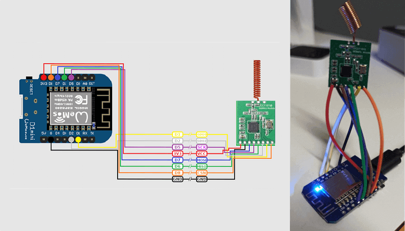
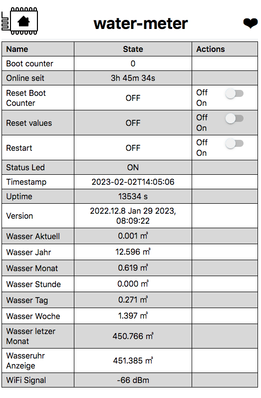

# Easy Watermeter Integration for Home Assistant


I did some experiments with **wmbusmeters**, **DVT SDR_STICK**, **NANOCUL** and ended up with: **Wemos D1 Min, CUL + CC1101 (esphome)**.

<br>

**Wemos D1 Mini + CC1101 (esphome)** is the best solution for me because the resource requirement is low.

With the NANOCUL solutions, I always had problems with the USB input and with the high resource consumption on the NUC or Raspberry computers.




### Requirements

- Water meter with IZAR module (Diehl IZAR RC 868 I R4 PL),
  IZAR Radio Compact Hall is designed for mobile reading and fixed network remote reading of Diehl Metering meters.
  <br>
- [Wemos D1 Mini CC1101](https://amzn.eu/d/0WQv07I)
- [Fayme CC1101 868MHZ Funk ÜBertragung Antennen Transceiver Modul, Grün](https://amzn.eu/d/i5YwBkR)


## Installation
[Wemos D1 Mini + CC1101 Installation](./esphome/README.md)

### What I still miss
Only the `total_m3` are currently decoded from the telegram. I am still looking for support on how to determine the further information from the telegram:

- Alarm (current_alarms, previous_alarms)
- Water last month (last_month_total_m3)
- Last Month date (last_month_measure_date)
- Battery (remaining_battery_life_y)
- Periode (transmit_period_s)

> see: https://github.com/weetmuts/wmbusmeters/discussions/835


## Result




<hr>

## Other solutions (alternatively)

- 1. [NANOCUL-DOCKER.md](NANOCUL-DOCKER.md)
- 2. [NANO-CUL.md](NANO-CUL.md)
- 3. [RB3B_DVBT - RTL232-md](RTL232-md)


<br>
<a href="https://www.buymeacoff.ee/zibous" target="_blank"></a>


### For more information see:

```
https://github.com/weetmuts/wmbusmeters
https://github.com/SzczepanLeon/esphome-components

https://osmocom.org/projects/rtl-sdr/wiki/Rtl-sdr
https://github.com/xaelsouth/rtl-wmbus
https://github.com/ZeWaren/izar-prios-smart-meter-collector

## DVB-T receiver or Nano CUL Adapter
https://www.amazon.de/Tragbarer-Mini-Digitaler-TV-Stock-Unterst%C3%BCtzung-SDR-Stimmer-Empf%C3%A4nger/dp/B013Q94CT6/ref=sr_1_2?__mk_de_DE=%C3%85M%C3%85%C5%BD%C3%95%C3%91&crid=3F9GCJKEPPNO7&dchild=1&keywords=dvbt+dongle&qid=1594904776&sprefix=dvbt+dong%2Caps%2C184&sr=8-2
https://www.smart-home-komponente.de/nano-cul/nano-cul-868-extra/

https://www.diehl.com/metering/en/portfolio/software-system-components/software-system-components-products/software-system-components-product/izar-radio-compact-hall/74843/

```

