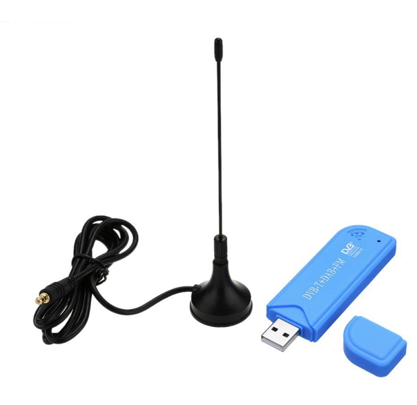

# Raspbian Buster + DVB-T receiver


### 
<br>

**Andoer Tragbarer Mini Digitaler TV Stock USB 2.0 DVB-T+DAB+FM+RTL2832U+FC0012 Chip Unterstützung SDR**




Digitaler TV Stock USB 2.0 DVB-T + DAB + FM + RTL2832U + FC0012 see: [Amazon](https://amzn.eu/d/8NNDo6A).

Details and Installation see:  [wmbusmeters-with-rtl-sdr.md](docs/wmbusmeters-with-rtl-sdr.md)


### Requirements

- Water meter with IZAR module (Diehl IZAR RC 868 I R4 PL),
  IZAR Radio Compact Hall is designed for mobile reading and fixed network remote reading of Diehl Metering meters.
  <br>
- Supported DVB-T receiver or Nano CUL Adapter,
  Andoer Tragbarer Mini Digitaler TV Stock USB 2.0 DVB-T + DAB + FM + RTL2832U + FC0012 Chip Unterstützung SDR Stimmer Empfänger
  <br>
- A computer. I’m using Raspbian Buster on a Raspberry Pi 3B+, but any Linux, macOS should work


## Integration

In the `wmbusmeters`  reporting mode, data will be published to the MQTT broker topic "`tele/wasser/verbrauch`".

This data can be subscribed to and processed by other applications. From this point forward your options are endless. Example for simple mode - publish all smartmeter display data:

```json
{
    "media": "water",
    "meter": "izar",
    "name": "watermeter",
    "id": "1231150",
    "total_m3": 166.625,
    "last_month_total_m3": 162.614,
    "last_month_measure_date": "2020-07-01",
    "remaining_battery_life_y": 13,
    "current_alarms": "no_alarm",
    "previous_alarms": "no_alarm",
    "timestamp": "2020-07-16T11:32:38Z"
}
```

### Continuous Daemon/Service

You most probably want to execute the program **continuously in the background**. This can be done either by using the internal daemon or cron.

**Attention:** Daemon mode must be enabled in the configuration file (default).

1. Systemd service - on systemd powered systems the **recommended** option

   ```bash
   sudo cp /opt/ha-watermeter/service.template /etc/systemd/system/ha-watermeter.service

   sudo systemctl daemon-reload
   sudo systemctl start ha-watermeter.service
   sudo systemctl status ha-watermeter.service

   sudo systemctl enable ha-watermeter.service
   ```


