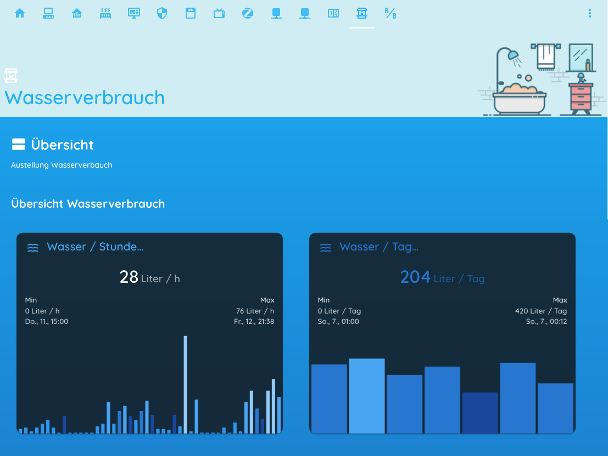
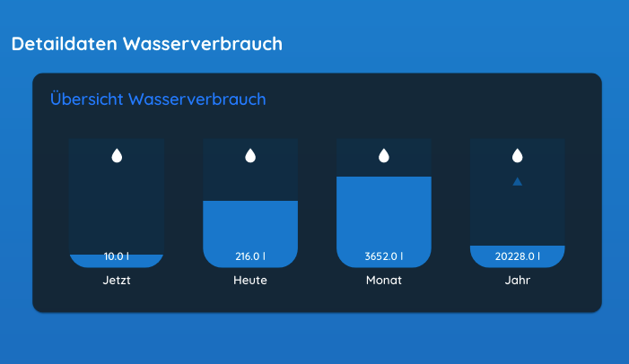

# Home-Assistant Watermeter View








## **MQTT - Datasource**

Installation ha-watermeter as MQTT Service see: https://github.com/zibous/ha-watermeter


```json
{
	"name": "Wasserz\u00e4hler Haus",
	"device": "watermeter",
	"deviceid": "983430778",
	"date": "2021-03-13",
	"time": "13:45:46",
	"total_m3": 234.489,
	"m3": {
		"current": 0.0,
		"hour": 0.028,
		"day": 0.204,
		"month": 3.64,
		"year": 20.216
	},
	"liter": {
		"current": 0.0,
		"hour": 28.0,
		"day": 204.0,
		"month": 3640.0,
		"year": 20216.0
	},
	"last_total": {
		"hour": "13",
		"hour_m3": 234.461,
		"day": "2021-03-13",
		"day_m3": 234.285,
		"month": "2021-03",
		"month_m3": 230.849,
		"year": "2021",
		"year_m3": 214.273
	},
	"alarm": "no_alarm",
	"last_alarm": "no_alarm",
	"periode": "2021-03-13",
	"month": "2021-03",
	"year": "2021",
	"timestamp": "2021-03-13T13:45:46Z",
	"last_update": "2021-03-13 14:45:46.914795",
	"elapsed_time": "0:00:17",
	"icon": "mdi:billboard",
	"unit_of_measurement": "\u33a5",
	"version": "1.0.0",
	"attribution": "Data provided by Peter Siebler",
	"data_provider": "smarthome.siebler.home"
}

```


## MQTT Sensor Homeassistant: `smartmeter-water.yaml`

```yaml
## ########################################
## Verbrauchsmessung Wasser
## Aktueller Verbrauch
## Liter =  total_m3 * 1000.000
## ########################################

## ######################################
## all from wmbusmeters
## MQTT-TOPIC: tele/wasser/verbrauch
## ######################################

## {
##  "media":"water",
##  "meter":"izar",
##  "name":"watermeter",
##  "id":"43430778",
##  "total_m3":166.204,
##  "last_month_total_m3":162.614,
##  "last_month_measure_date":"2020-07-01",
##  "remaining_battery_life_y":13,
##  "current_alarms":"no_alarm",
##  "previous_alarms":"no_alarm",
##  "timestamp":"2020-07-14T14:18:45Z"
## }

- platform: mqtt
  name: "Wasserzähler aktuell"
  state_topic: "tele/wasser/verbrauch"
  unit_of_measurement: "m³"
  value_template: "{{ value_json['total_m3']|default(0.000)}}"
  icon: mdi:counter

- platform: mqtt
  name: "Wasserzähler letzer Monat"
  state_topic: "tele/wasser/verbrauch"
  unit_of_measurement: "m³"
  value_template: "{{ value_json['last_month_total_m3']|default(0.000)}}"
  icon: mdi:counter

- platform: mqtt
  name: "Wasserzähler Alarm"
  state_topic: "tele/wasser/verbrauch"
  value_template: "{{ value_json['current_alarms']|default('OFFLINE')}}"
  json_attributes_topic: "tele/wasser/verbrauch"
  icon: mdi:alarm-light-outline

- platform: mqtt
  name: "Wasserzähler voriger Alarm"
  state_topic: "tele/wasser/verbrauch"
  value_template: "{{ value_json['previous_alarms']|default('OFFLINE')}}"
  json_attributes_topic: "tele/wasser/verbrauch"
  icon: mdi:alarm-light-outline

- platform: mqtt
  name: "Wasserzähler Zeit"
  state_topic: "tele/wasser/verbrauch"
  value_template: "{{ value_json['timestamp']|default('OFFLINE')}}"
  json_attributes_topic: "tele/wasser/verbrauch"
  icon: mdi:timetable

- platform: mqtt
  name: "Wasserzähler vorige Messung"
  state_topic: "tele/wasser/verbrauch"
  value_template: "{{ value_json['timestamp']|default('OFFLINE')}}"
  json_attributes_topic: "tele/wasser/verbrauch"
  icon: mdi:timetable

- platform: mqtt
  name: "Wasserzähler Status"
  state_topic: "tele/wasser/verbrauch"
  value_template: >-
    
      Sensor online
    
      Sensor {{ value_json['current_alarms']|default('OFFLINE') }}!
    
  json_attributes_topic: "tele/wasser/verbrauch"
  icon: mdi:message-processing
- platform: mqtt
  name: "Wasserverbrauch"
  state_topic: "tele/smartmeter/wasser"
  unit_of_measurement: "m³"
  value_template: "{{ value_json['m3'].current|default(0.000)|float }}"
  icon: mdi:waves

- platform: mqtt
  name: "Wasseraktuell Liter"
  state_topic: "tele/smartmeter/wasser"
  unit_of_measurement: "l"
  value_template: "{{ value_json['liter'].current|default(0.000)|float }}"
  icon: mdi:water

- platform: mqtt
  name: "Wasser pro Stunde"
  state_topic: "tele/smartmeter/wasser"
  unit_of_measurement: "m³"
  value_template: "{{ value_json['m3'].hour|default(0.000)|float }}"
  icon: mdi:water

- platform: mqtt
  name: "Wasser Liter/h"
  state_topic: "tele/smartmeter/wasser"
  unit_of_measurement: "l"
  value_template: "{{ value_json['liter'].hour|default(0.000)|float }}"
  icon: mdi:water

- platform: mqtt
  name: "Wasser pro Tag"
  state_topic: "tele/smartmeter/wasser"
  unit_of_measurement: "m³"
  value_template: "{{ value_json['m3'].day|default(0.000)|float }}"
  icon: mdi:water

- platform: mqtt
  name: "Wasser Liter/Tag"
  state_topic: "tele/smartmeter/wasser"
  unit_of_measurement: "l"
  value_template: "{{ value_json['liter'].day|default(0.000)|float }}"
  icon: mdi:water

- platform: mqtt
  name: "Wasser pro Monat"
  state_topic: "tele/smartmeter/wasser"
  unit_of_measurement: "m³"
  value_template: "{{ value_json['m3'].month|default(0.000)|float }}"
  icon: mdi:water

- platform: mqtt
  name: "Wasser Liter/Monat"
  state_topic: "tele/smartmeter/wasser"
  unit_of_measurement: "l"
  value_template: "{{ value_json['liter'].month|default(0.000)|float }}"
  icon: mdi:water

- platform: mqtt
  name: "Wasser pro Jahr"
  state_topic: "tele/smartmeter/wasser"
  unit_of_measurement: "m³"
  value_template: "{{ value_json['m3'].year|default(0.000)|float }}"
  icon: mdi:water

- platform: mqtt
  name: "Wasser Liter/Jahr"
  state_topic: "tele/smartmeter/wasser"
  unit_of_measurement: "l"
  value_template: "{{ value_json['liter'].year|default(0.000)|float }}"
  icon: mdi:water

- platform: mqtt
  name: "Wasser Alarm"
  state_topic: "tele/smartmeter/wasser"
  json_attributes_topic: "tele/smartmeter/wasser"
  icon: mdi:alarm-light-outline
  unit_of_measurement: ""
  value_template: >
    
    
    
    {{ alarm }}

- platform: mqtt
  name: "Wasser letzter Alarm"
  state_topic: "tele/smartmeter/wasser"
  icon: mdi:alarm-light-outline
  json_attributes_topic: "tele/smartmeter/wasser"
  unit_of_measurement: ""
  value_template: >
    
    
    
    {{ alarm }}

- platform: mqtt
  name: "Zählerstand"
  state_topic: "tele/smartmeter/wasser"
  value_template: "{{ value_json['total_m3']|default(0.000)}}"
  unit_of_measurement: "m³"
  json_attributes_topic: "tele/smartmeter/wasser"
  icon: mdi:counter

- platform: mqtt
  name: "Hauswasserzähler Status"
  state_topic: "tele/smartmeter/wasser"
  value_template: "{{ value_json['last_update']|default('OFFLINE')}}"
  json_attributes_topic: "tele/smartmeter/wasser"
  icon: mdi:timetable
  
- platform: template

  sensors:
    ## calculate the water costs

    water_cost_current:
      friendly_name: "Wasser aktuell"
      value_template:  >-
          {{ (states("sensor.wasserverbrauch")|float * states.input_number.cost_m3_wasser.state|float)|round(2)}}
      unit_of_measurement: "€"

    water_cost_hour:
      friendly_name: "Wasser pro Stunde"
      value_template:  >-
          {{ (states("sensor.wasser_pro_stunde")|float * states.input_number.cost_m3_wasser.state|float)|round(2)}}
      unit_of_measurement: "€"

    water_cost_day:
      friendly_name: "Wasser pro Tag"
      value_template:  >-
          {{ (states("sensor.wasser_pro_tag")|float * states.input_number.cost_m3_wasser.state|float)|round(2)}}
      unit_of_measurement: "€"

    water_cost_month:
      friendly_name: "Wasser pro Monat"
      value_template:  >-
          {{ (states("sensor.wasser_pro_monat")|float * states.input_number.cost_m3_wasser.state|float)|round(2)}}
      unit_of_measurement: "€"

    water_cost_jahr:
      friendly_name: "Wasser pro Jahr"
      value_template:  >-
           {{ (states("sensor.wasser_pro_jahr")|float * states.input_number.cost_m3_wasser.state|float)|round(2)}}
      unit_of_measurement: "€"

  

```


### **Watercost Parameter**: `input_numbers/water.yaml`

```yaml
## #########################################################################################
## calulation for a month:
##
##   (m3_water*cost_m3_wasser) +
##   (m3_water*cost_m3abwasser) +
##   cost_watermeterfee+ cost_waterbasefee
## ############################################################################################
cost_m3_wasser:
  name: Wasser €/m3
  icon: mdi:currency-eur
  initial: 5.4176
  unit_of_measurement: "€"
  min: 5.00
  max: 10.00
  mode: box

cost_m3wasser:
  name: Wasserbezugsgebühr
  icon: mdi:currency-eur
  initial: 0.88
  unit_of_measurement: "€"
  min: 0.80
  max: 1.50
  mode: box
  
cost_m3abwasser:
  name: Kanalbenützungsgebühr
  icon: mdi:currency-eur
  initial: 3.38
  unit_of_measurement: "€"
  min: 3.00
  max: 5.00
  mode: box

cost_watermeterfee:
  name: Zählermiete / Monat
  icon: mdi:currency-eur
  initial: 2.157
  unit_of_measurement: "€"
  min: 2.000
  max: 3.500
  mode: box

cost_waterbasefee:
  name: Wassergrundgebühr / Monat
  icon: mdi:currency-eur
  initial: 4.917
  unit_of_measurement: "€"
  min: 4.800
  max: 6.500
  mode: box  

max_m3_day:
  name: Wasser m3 pro Tag
  icon: mdi:counter
  initial: 0.60
  unit_of_measurement: "\u33A5"
  min: .200
  max: 3.00
  mode: box  

max_m3_month:
  name: Wasser m3 pro Monat
  icon: mdi:counter
  initial: 15.00
  unit_of_measurement: "\u33A5"
  min: 5.00
  max: 20.00
  mode: box  

max_m3_year:
  name: Wasser m3 pro Jahr
  icon: mdi:counter
  initial: 102.000
  unit_of_measurement: "\u33A5"
  min: 80.00
  max: 200.00
  mode: box  

```


## **Lovelace Ressourcen**

- **custom:cards-layout** 

  see: https://github.com/zibous/ha-layoutcard

  ```yaml
  ## ha-layout card
  - url: /hacsfiles/cards-layout/cards-layout.js
    type: module
  ```

  

- **custom:homekit-card**

  see: https://github.com/DBuit/Homekit-panel-card

  ```yaml
  # ## homekit panel card
  - url: /hacsfiles/Homekit-panel-card/homekit-panel-card.js
    type: module**Datasource**
  ```


- **custom:bar-card**

  see: https://github.com/custom-cards/bar-card

  ```yaml
  # ## bar card
  - url: /hacsfiles/bar-card/bar-card.js
    type: module
  ```

  

- **custom:mini-graph-card**

  see :https://github.com/kalkih/mini-graph-card

  ```yaml
  # ## mini graph card
  - url: /hacsfiles/mini-graph-card/mini-graph-card-bundle.js
    type: module
  ```


## Layout


```yaml
## ######################################################
##
##   VIEW SMARTMETER WATER
##
##   - custom:cards-layout
##   - custom:homekit-card
##
## ######################################################

icon: 'mdi:water-well-outline'
id: WATERDIEHL
title: Wasser
panel: true
path: water

cards:
  - type: 'custom:cards-layout'
    toolbar:
      backgroundcolor: '#D0EDF5'
      iconcolor: '#1AB0F4'
      visible: true
    header:
      title: Wasserverbrauch
      icon: 'mdi:water-well-outline'
      iconcolor: '#1AB0F4'
      style: >-
        background-image: url('/hacsfiles/cards-layout/assets/ha-header-bathroom.png');
        background-color: #D0EDF5;
        color: #1AB0F4;
    page:
      title: Übersicht
      icon: 'mdi:view-agenda'
      description: Austellung Wasserverbauch
      width: 95%
      style: >-
        color:"#FFFFFF";
        background: linear-gradient(to top, #0C47A1,#03A9F4);
    content:
      - row:
          - columns:
            title: 'Übersicht Wasserverbrauch'
            width: 50%
            entities:
              - !include ../cards/smartmeter-water/card-water-overview.yaml
              - !include ../cards/smartmeter-water/card-water-days.yaml
      - row:
          - columns:
            title: Detaildaten Wasserverbrauch
            width: 100%
            entities:
              - !include ../cards/smartmeter-water/card-water-usage.yaml
      - row:
          - columns:
            title: 'Details zu Wasserverbrauch & - Kosten'
            width: 100%
            
            ## custom:homekit-card buttons
            entities:
              - type: 'custom:homekit-card'
                useBrightness: false
                titleColor: '#fff'
                enableColumns: false
                statePositionTop: true
                home: false
                style: |
                  .card-title {
                    font-size: 1.25em !important;
                    line-height: 3em !important;
                    padding-top: 18px !important;
                  }
                  .name {
                    font-size: 0.90em !important;
                  }
                  .state{
                    overflow: hidden !important;
                    text-overflow: ellipsis !important;
                  }
                tap_action:
                  action: more-info
                entities:
                  - title: 'Wasserverbrauch'
                    entities:
                      - entity: sensor.wasseraktuell_liter
                        name: zur Zeit
                        tap_action:
                          action: more-info
                          entity: sensor.wasseraktuell_liter
                      - entity: sensor.wasser_liter_h
                        name: Jetzt
                        tap_action:
                          action: more-info
                          entity: sensor.wasser_liter_h
                      - entity: sensor.wasser_liter_tag
                        name: Heute
                        tap_action:
                          action: more-info
                          entity: sensor.wasser_liter_tag
                      - entity: sensor.wasser_liter_monat
                        name: Monat
                        tap_action:
                          action: more-info
                          entity: sensor.wasser_liter_monat
                      - entity: sensor.wasser_liter_jahr
                        name: Jahr
                        tap_action:
                          action: more-info
                          entity: sensor.wasser_liter_jahr

                  - title: 'Wasser Kosten'
                    entities:
                      - entity: sensor.water_cost_current
                        name: zur Zeit
                        tap_action:
                          action: more-info
                          entity: sensor.water_cost_current
                      - entity: sensor.water_cost_hour
                        name: Jetzt
                        tap_action:
                          action: more-info
                          entity: sensor.water_cost_hour
                      - entity: sensor.water_cost_day
                        name: Heute
                        tap_action:
                          action: more-info
                          entity: sensor.water_cost_day
                      - entity: sensor.water_cost_month
                        name: Monat
                        tap_action:
                          action: more-info
                          entity: sensor.water_cost_month
                      - entity: sensor.water_cost_jahr
                        name: Jahr
                        tap_action:
                          action: more-info
                          entity: sensor.water_cost_jahr

                  - title: 'Wasserzähler Anzeige'
                    entities:
                      - entity: sensor.wasserzahler_aktuell
                        name: Gesamt m³
                        tap_action:
                          action: more-info
                          entity: sensor.wasserzahler_aktuell
                      - entity: sensor.wasser_pro_monat
                        name: m³/Monat
                        tap_action:
                          action: more-info
                          entity: sensor.wasser_pro_monat
                      - entity: sensor.wasser_pro_jahr
                        name: m³/Jahr
                        tap_action:
                          action: more-info
                          entity: sensor.wasser_pro_jahr
                      - entity: sensor.wasserzahler_status
                        name: Status
                        tap_action:
                          action: more-info
                          entity: sensor.wasserzahler_status
                      - entity: sensor.wasser_alarm
                        name: Alarm
                        tap_action:
                          action: more-info
                          entity: sensor.wasser_alarm

```


