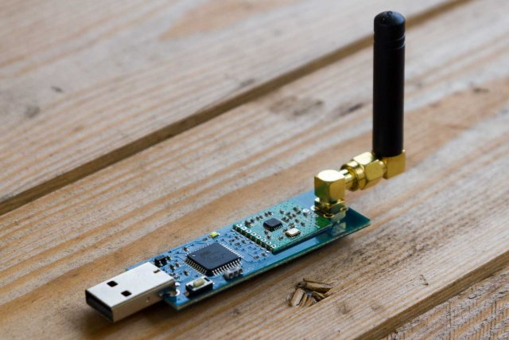

## Testcase Flash CUL-Stick `Der neue CUL Stick`





see: https://www.smarthome-agentur.de/blog/der-neue-cul-stick/
<br>


## Install dfu programmer

```bash
$ sudo apt-get install dfu-programmer
```


## Testen

```bash
$ dmesg -w

[502026.204435] cdc_acm 1-1.2:1.0: ttyACM0: USB ACM device
[502089.503199] usb 1-1.2: USB disconnect, device number 6
[511471.430603] usb 1-1.3: new full-speed USB device number 7 using dwc_otg
[511471.576592] usb 1-1.3: New USB device found, idVendor=03eb, idProduct=204b, bcdDevice= 0.00
[511471.576619] usb 1-1.3: New USB device strings: Mfr=1, Product=2, SerialNumber=0
[511471.576634] usb 1-1.3: Product: CUL868
[511471.576649] usb 1-1.3: Manufacturer: busware.de
[511471.577971] cdc_acm 1-1.3:1.0: ttyACM0: USB ACM device

```
<br>


## Flashing CUL V3 MBUS

```bash
$ su -
$ cd /opt && mkdir nanocul && cd /opt/nanocul
$ wget https://github.com/smarthomeagentur/culfw1/releases/download/180dcb5/CUL_V3_MBUS.hex

## der Chip muss erst in den DFU Mode. Entweder per Serial verbinden
## und "B99" senden oder die Lötbrücke "HWB" auf der rückseite schließen.
## Wenn der Stick dann am USB ist und per taste resetet wird, ist er im DFU

## the chip must first be in DFU mode. Either connect via serial
## and send "B99" or close the solder bridge "HWB" on the back.
## If the stick is on the USB and then reset by pressing the button, now it is in the DFU

## insert nanocul and test usb port
$ lsusb
--> Bus 001 Device 007: ID 03eb:204b Atmel Corp. LUFA USB to Serial Adapter Project

$ ls -l /dev/serial/by-id
--> usb-busware.de_CUL868-if00 -> ../../ttyACM0

## flash the CUL_V3_MBUS firmware
$ dfu-programmer atmega32u4 erase || true
$ dfu-programmer atmega32u4 flash CUL_V3_MBUS.hex

--> Validating...
    18582 bytes used (64.81%)

$ dfu-programmer atmega32u4 start

## re-insert nanocul stick
$ lsusb
$ ls -l /dev/serial/by-id

## test wmbusmeters
$ wmbusmeters auto:t1 /dev/ttyACM0
$ wmbusmeters --listento=t1 --debug --logtelegrams /dev/ttyACM0 diehl izar 43410778 NOKEY
```

see: https://www.computerhilfen.de/info/fhem-cul-flashen-und-neue-firmware-installieren.html

## Status Led Nanocul
Command: l<hex>
   Set the led mode. - 00: Set LED off - 01: Set LED on - 02: The LED will blink once a second

```bash
    $:~# echo  'l00' > /dev/ttyACM1
    $:~# echo  'l01' > /dev/ttyACM1
    $:~# echo  'l00' > /dev/ttyACM1
```

## Test with python serial.tools.miniterm
```bash
$~# python3 -m serial.tools.miniterm

--- Available ports:
---  1: /dev/ttyACM0         'ConBee II'
---  2: /dev/ttyACM1         'CUL868'
--- Enter port index or full name: 2
--- Miniterm on /dev/ttyACM1  9600,8,N,1 ---
--- Quit: Ctrl+] | Menu: Ctrl+T | Help: Ctrl+T followed by Ctrl+H ---
b1944A5117807414344183F7CA2211800133E1EFEC6F8435F4CC5DB87620F8E1F
b1944A511780743434418491CA2711800133C641E9A9BA726CF1186D92B42A00F
b1944A5117807414344183F7CA2311800133E09D18F53628C951EC285A949941F
b1944A5117807414344183F7CA2411800133E6C1D730287B7981F8D88E4FE8D1F
b1944A511780743434418491CA2111800133C16FD2F6163CE1BCBD0D6ADB3970F
```

## Create WMBUSMETERS config
```bash
$su -
$ mkdir -p /docker/wmbusmeters/etc && cd /docker/wmbusmeters/etc
$ mkdir wmbusmeters.d

## create the watermeter config for the id (printed on the meter)
$echo '
name=watermeter
type=izar
id=18444343
key=
'>wmbusmeters.d/diehl

## create the wmbusmeters config
echo '
loglevel=normal
device=auto:t1
device=/dev/ttyACM1
logtelegrams=true
format=json
## logging
## meterfiles=/var/log/wmbusmeters/meter_readings
## meterfilesaction=append
## logfile=/var/log/wmbusmeters/wmbusmeters.log
## additonal settings
## meterfilesnaming=name
## meterfilestimestamp=hour
## ignoreduplicates=true
alarmtimeout=1h
alarmexpectedactivity=mon-sun(00-23)
## MQTT Brocker settings
shell=/usr/bin/mosquitto_pub -h 10.1.1.94 -p 1883 -u MQTTUSERNAME -P MQTTPASSWORD -t tele/watermeter -m "$METER_JSON"
alarmshell=/usr/bin/mosquitto_pub -h 10.1.1.94  -u MQTTUSERNAME -P MQTTPASSWORD -t   tele/watermeter/_alarm -m "$ALARM_TYPE $ALARM_MESSAGE"
'>wmbusmeters.conf
```
<br>

## Install Docker Image

```bash
docker run -d --privileged \
    --name=wmbusmeters \
    --restart=always \
    -v /etc/localtime:/etc/localtime:ro \
    -v /docker/wmbusmeters:/wmbusmeters_data \
    -v /dev/:/dev/ \
    weetmuts/wmbusmeters
```

see: https://hub.docker.com/r/weetmuts/wmbusmeters

<br>

## Docker Log
```log
2021-11-05T12:29:17.268083085Z Started config cul on /dev/ttyACM1 listening on t1,
2021-11-05T12:30:04.324756538Z telegram=|1944A511780743434418A2|011800133C0FD266CA421DC210C9D4|+49,
2021-11-05T12:31:55.697491534Z telegram=|1944A511780743434418A2|511800133C444009CDE4817CA7B4DC|+160
```
<br>

## MQTT Brocker Message

```Json
{
 "media":"water",
 "meter":"izar",
 "name":"watermeter",
 "id":"18444343",
 "prefix":"",
 "serial_number":"000000",
 "total_m3":312.811,
 "last_month_total_m3":312.412,
 "last_month_measure_date":"2021-11-01",
 "remaining_battery_life_y":12,
 "current_alarms":"no_alarm",
 "previous_alarms":"no_alarm",
 "transmit_period_s":8,
 "manufacture_year":"0",
 "timestamp":"2021-11-03T15:02:37Z",
 "device":"cul",
 "rssi_dbm":-70
}

```


