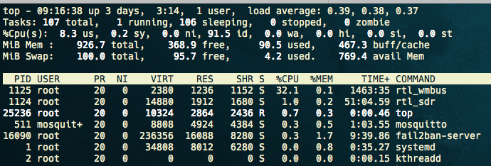
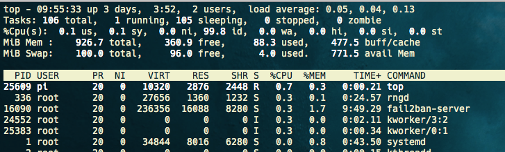

# wmbusmeters version: 0.9.34 with NANO-CUL (mbus) 868 Mhz


NANO-CUL (mbus) 868 is a lot easier to use because it only requires `wmbusmeters`. 
The resources (memory) required are also less compared to the variant with RTL-SDR and rtl-wmbus. 
#### RTL-SDR and rtl-wmbus: 32 % CPU

<br>
The tests also show that the signal processing is better and thus the range for receiving the data is increased.
#### NANO-CUL (mbus) 868: 0.7 % CPU !


`nano CUL 868 mit Externer Magnetfußantenne` , see: https://www.smart-home-komponente.de/

## Update system

The following is required before installation:

```bash
$ sudo apt-get update
$ sudo apt-get install build-essential libncurses-dev cmake automake make 
$ sudo apt-get install -y mosquitto mosquitto-clients librtlsdr-dev libxml2-dev
```

## Build wmbusmeters

The program receives and decodes C1,T1 or S1 telegrams (using the wireless mbus protocol) to acquire utility meter readings. The readings can then be published using MQTT, curled to a REST api, inserted into a database or stored in a log file.

```bash
$ git clone https://github.com/weetmuts/wmbusmeters.git
$ cd wmbusmeters
$ make && make test

$ make install

## optional, only if debuging
$ make DEBUG=true

$ lsusb
## --> Bus 001 Device 004: ID 0403:6001 Future Technology Devices International, Ltd FT232 Serial (UART) IC

$ ls -l /dev/serial/by-id
## --> lrwxrwxrwx 1 root root 13 Feb  8 09:33 usb-SHK_NANO_CUL_868-if00-port0 -> ../../ttyUSB0

$ ls -l /dev/ttyUSB0
## >>  wmbusmeters 188,   0 Jul 21 13:50 ttyUSB0

$ dmesg | grep ttyUSB0
##[  491.198770] usb 2-5: FTDI USB Serial Device converter now attached to ttyUSB0
##[ 2413.835006] ftdi_sio ttyUSB0: FTDI USB Serial Device converter now ##disconnected from ttyUSB0
##[ 2419.879307] usb 2-5: FTDI USB Serial Device converter now attached to ttyUSB0


# get the id for the watermeter
$ wmbusmeters --listento=t1 /dev/ttyUSB0

```

Result from the test:  `wmbusmeters --listento=t1 /dev/ttyUSB0`

```verilog
Results:

No meters configured. Printing id:s of all telegrams heard!

Received telegram from: 43410778
          manufacturer: (DME) DIEHL Metering, Germany
           device type: Pressure meter
Received telegram from: 15300778
          manufacturer: (DME) DIEHL Metering, Germany
           device type: A/D converter
Received telegram from: 43430778
          manufacturer: (DME) DIEHL Metering, Germany
           device type: Pressure meter
```


## Debug and test installed wmbusmeters

```bash
wmbusmeters --listento=t1 --debug --logtelegrams /dev/ttyUSB0 diehl izar 43410778 NOKEY

>> (izar) 0a: a2 tpl-ci-field (Mfct specific)
diehl	43410778	87.511 m3	84.654 m3	2020-07-01	13 y	no_alarm	no_alarm	2020-07-21 14:08.40


```


## Configuration wmbusmeters

Check the config file `nano /etc/wmbusmeters.conf` and edit the device to point to your dongle.

```ini
loglevel=normal
device=/dev/ttyUSB0
logtelegrams=true
format=json
meterfiles=/var/log/wmbusmeters/meter_readings
meterfilesaction=overwrite
meterfilesnaming=name
meterfilestimestamp=hour
logfile=/var/log/wmbusmeters/wmbusmeters.log
shell=/usr/bin/mosquitto_pub -h mbs.siebler.home -p 1883 -u "username" -P "password" -t tele/testsensor/verbrauch -m "$METER_JSON"
```


Then add a meter file in `nano /etc/wmbusmeters.d/diehl`

```ini
name=watermeter
type=izar
id=43430778
key=
```


## Service wmbusmeters

```bash
$ sudo systemctl daemon-reload

$ systemctl start wmbusmeters
$ systemctl status wmbusmeters
$ systemctl enable wmbusmeters
$ systemctl stop wmbusmeters
$ systemctl restart wmbusmeters

```

