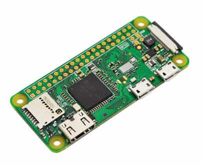

# RASPIOS "buster armhf lite" for Raspberry Zero


## Hardware

**Raspberry Pi Zero W** 

The Raspberry Pi Zero W extends the Pi Zero family and comes with added wireless LAN and Bluetooth connectivity.



**Andoer Tragbarer Mini Digitaler TV Stock USB 2.0 DVB-T+DAB+FM+RTL2832U+FC0012 Chip Unterstützung SDR**


https://www.amazon.de/gp/product/B013Q94CT6/ref=as_li_tl?ie=UTF8&tag=az-shop--21&camp=1638&creative=6742&linkCode=as2&creativeASIN=B013Q94CT6&linkId=b8e69c7c04ce7b81cea71b26ed2c110d


## Workflow for wmbusmeters with rtl-sdr

1. Install System RASPIOS + Packages
2. Build rtl-sdr from git.osmocom.org
3. Builds  rtl-wmbus from github.com/weetmuts/wmbusmeters
4. Build wmbusmeters from github.com/weetmuts/wmbusmeters
5. Test Build and installation
6. Enable Services on Startup


## Install System RASPIOS

`Raspberry Pi Imager v1.6` has an advanced menu which is hidden away from general users just looking to write an operating system for the Pi Raspios 

To activate the menu we need to press CTRL + SHIFT + X and we then gain access to advanced options that enable advanced users to customize the OS to meet their needs before they write the software to a micro SD card. 

```bash
# 1. flash Ubuntu 20.04.2 to sd card 2021-05-07-raspios-buster-armhf-lite.zip
# 2. customize the setting with Raspberry Pi Imager (CTRL + SHIFT + X)
#    WLAN, SSH, Hostname
# 3. insert sd card to rasberry zero board
# 4. Connect the power supply to the rasberry zero board

# SSH from client (user:pi, passwort: raspberry)
$: ssh -t pi@raspberry.local  -p 22

# set password, user
pi@raspberryp: sudo passwd root
New password: *******
passwd: password updated successfully
pi@raspberryp: sudo passwd pi
New password: *******
passwd: password updated successfully

# update configuration
pi@raspberryp: su -
password: *******
root@raspberryp: raspi-config
# 1. set locale
# 2. update --> raspi-config is already the newest version (20210212)
# 3. set hostname rbzero
# 4. reboot

# ----------------------------------------------------------------
# install base packages
# Linux rbzero 5.10.17+ #1414 Fri Apr 30 13:16:27 BST 2021 armv6l
# ----------------------------------------------------------------
pi@rbzero: su -
Passwort: ******

root@rbzero: sudo apt-get dist-upgrade
root@rbzero: sudo apt update && sudo apt upgrade -y
>> OK:1 http://raspbian.raspberrypi.org/raspbian buster InRelease
>> OK:2 http://archive.raspberrypi.org/debian buster InRelease

root@rbzero: sudo nano /etc/apt/sources.list
>> Uncomment line below then 'apt-get update' to enable 'apt-get source'
root@rbzero: sudo apt update && sudo apt full-upgrade && sudo apt autoremove
root@rbzero: sudo apt install \
                      mc software-properties-common unattended-upgrades \
                      net-tools apt-transport-https \
                      git curl binutils wget mc lnav \
                      needrestart locate wireless-tools \
                      nfs-common cifs-utils parted dosfstools \
                      samba samba-common-bin python3-pip \
                      mosquitto mosquitto-clients libmosquitto-dev libmosquitto1 -y
root@rbzero: sudo reboot now                      
```


## Install Developer Tools

```bash
pi@raspberrypi: su -
password: *******

root@rbzero: apt-get update
# ----------------------------------------
# install build packages
# ----------------------------------------
root@rbzero: sudo apt install ncurses-dev cmake librtlsdr-dev \
             cmake libusb-1.0-0-dev build-essential libtool-bin  \
             automake make info libc6-dev libgmp-dev \
             libgmp3-dev gawk qpdf bison -y
root@rbzero: sudo reboot now              
```


## RTL-SDR: Inexpensive Software Defined Radio

Turns your Realtek RTL2832 based DVB dongle into a SDR receiver


## Driver Installation Instructions

All the installation instructions below were derived from the following links:

- http://sdr.osmocom.org/trac/wiki/rtl-sdr
- https://osmocom.org/projects/rtl-sdr/wiki/Rtl-sdr
- http://www.rtlsdr.org
- https://github.com/steve-m/librtlsdr
- 

## Build rtl-sdr (git.osmocom.org)

The Osmocom RTL-SDR library must be installed before you can build rtl-wmbus. See http://sdr.osmocom.org/trac/wiki/rtl-sdr for more information.

Here, we will provide you with binaries and basic installation that  will enable you to get tune to a frequency and get samples into Matlab or GNU Octave. If you are bold, you can go  to the aove websites and follow the installation instructions. There are instructions there to install additional software, such as  GNU-radio or SDR.  To install rtl-wmbus, download, unpack the source code and go to the top level directory. 

```bash
pi@raspberrypi: su -
password: *******
# root@rbzero: apt install rtl-sdr

## --------------------------
## build rtl-sdr from source
## --------------------------
root@rbzero: cd ~
# get the rtl-sdr from git.osmocom.org
root@rbzero: sudo git clone git://git.osmocom.org/rtl-sdr.git
root@rbzero: cd rtl-sdr/
root@rbzero: sudo mkdir build && sudo cd build
root@rbzero: cd build

root@rbzero: sudo cmake ../ -DINSTALL_UDEV_RULES=ON
# root@rbzero: sudo cmake ../ -DINSTALL_UDEV_RULES=ON -DDETACH_KERNEL_DRIVER=ON
-- Build type not specified: defaulting to release.
-- Extracting version information from git describe...
-- Building with kernel driver detaching disabled, use -DDETACH_KERNEL_DRIVER=ON to enable
-- Building with usbfs zero-copy support disabled, use -DENABLE_ZEROCOPY=ON to enable
-- Building for version: 0.6.0-28-g0847 / 0.6git
-- Using install prefix: /usr/local
-- Configuring done
-- Generating done
-- Build files have been written to: /root/rtl-sdr/build

# install rtl-sdr
root@rbzero: sudo make
root@rbzero: sudo make install
root@rbzero: sudo ldconfig
root@rbzero: sudo cp ../rtl-sdr.rules /etc/udev/rules.d/
root@rbzero: sudo cp /usr/local/bin/rtl_sdr /usr/bin/rtl_sdr
root@rbzero: sudo udevadm control --reload-rules

## Test rtl-sdr
root@rbzero: lsusb | grep DVB
- Bus 001 Device 002: ID 0bda:2838 Realtek Semiconductor Corp. RTL2838 DVB-T

root@rbzero: rtl_sdr
-- rtl_sdr, an I/Q recorder for RTL2832 based DVB-T receivers
-- Usage:	 -f frequency_to_tune_to [Hz]
	-- [-s samplerate (default: 2048000 Hz)]
	-- [-d device_index (default: 0)]
	-- [-g gain (default: 0 for auto)]
	-- [-p ppm_error (default: 0)]
	-- [-b output_block_size (default: 16 * 16384)]
	-- [-n number of samples to read (default: 0, infinite)]
	-- [-S force sync output (default: async)]
	-- filename (a '-' dumps samples to stdout)

root@rbzero: sudo reboot
```


### For more information see:

```txt
https://www.raspberry-pi-geek.de/ausgaben/rpg/2014/06/luftraum-ueberwachen-mit-dem-raspberry-pi/2/
https://www.az-delivery.de/blogs/azdelivery-blog-fur-arduino-und-raspberry-pi/raspberry-headless-setup-rtl-sdr
https://gist.github.com/floehopper/99a0c8931f9d779b0998
```


#### Prevent the default RTL-SDR drivers from being loaded automatically. 

Open the file raspi-blacklist, Blacklists DVB-T kernel modules provided by the Linux kernel

Not that if rtl-sdr applications are then run, they will complain about failing to open the device. In that case, restore the blacklist and unplug/plug the USB stick. If librtlsdr-blacklist.conf does not exist, then rtl-sdr was built with the DETACH_KERNEL_DRIVER option.

see: https://jselec.nl/?p=3282

```bash
pi@raspberrypi: su -
password: *******

root@rbzero: sudo modprobe -r dvb_usb_rtl28xxu
root@rbzero: sudo rmmod dvb_usb_rtl28xxu

root@rbzero: cat <<EOF >no-rtl.conf
blacklist dvb_usb_rtl28xxu
blacklist dvb_usb_v2
blacklist dvb_core
blacklist rtl2832
blacklist rtl2830
EOF

root@rbzero: sudo mv no-rtl.conf /etc/modprobe.d/
root@rbzero: sudo reboot

```


## Test rtl-sdr

Connect your USB dongle to your computer and run the rtl_test. You should get the following output:

```bash
pi@raspberrypi: su -
password: *******

## Check usb dongle and rtl-sdr 
root@rbzero: lsusb
- Bus 001 Device 002: ID 0bda:2838 Realtek Semiconductor Corp. RTL2838 DVB-T
- Bus 001 Device 001: ID 1d6b:0002 Linux Foundation 2.0 root hub
root@rbzero: rtl_test

rtl_test
- Found 1 device(s):
   0:  Realtek, RTL2838UHIDIR, SN: 00000001

- Using device 0: Generic RTL2832U OEM
- Found Fitipower FC0012 tuner
- Supported gain values (5): -9.9 -4.0 7.1 17.9 19.2
- Sampling at 2048000 S/s.

- Info: This tool will continuously read from the device, and report if
  samples get lost. If you observe no further output, everything is fine.

- Reading samples in async mode...
  Allocating 15 zero-copy buffers
  lost at least 204 bytes

root@rbzero: rtl_eeprom
- Found 1 device(s):
  0:  Generic RTL2832U OEM

- Using device 0: Generic RTL2832U OEM
  Found Fitipower FC0012 tuner
  Current configuration:
  __________________________________________
  Vendor ID:		0x0bda
  Product ID:		0x2838
  Manufacturer:		Realtek
  Product:		RTL2838UHIDIR
  Serial number:		00000001
  Serial number enabled:	yes
  IR endpoint enabled:	yes
  Remote wakeup enabled:	no
  __________________________________________

root@rbzero: rtl_test -p
- Found 1 device(s):
  0:  Realtek, RTL2838UHIDIR, SN: 00000001
  Using device 0: Generic RTL2832U OEM
  Found Fitipower FC0012 tuner
  Supported gain values (5): -9.9 -4.0 7.1 17.9 19.2
  Sampling at 2048000 S/s.
  Reporting PPM error measurement every 10 seconds...
  Press ^C after a few minutes.
  Reading samples in async mode...
  Allocating 15 zero-copy buffers
  lost at least 116 bytes
  real sample rate: 2046865 current PPM: -554 cumulative PPM: -554
  real sample rate: 2048039 current PPM: 19 cumulative PPM: -257
  real sample rate: 2048016 current PPM: 8 cumulative PPM: -166
  real sample rate: 2048079 current PPM: 39 cumulative PPM: -114
  real sample rate: 2048038 current PPM: 19 cumulative PPM: -87
  
root@rbzero: rtl_test -t
 - Found 1 device(s):
   0:  Realtek, RTL2838UHIDIR, SN: 00000001
   Using device 0: Generic RTL2832U OEM
   Found Fitipower FC0012 tuner
   Supported gain values (5): -9.9 -4.0 7.1 17.9 19.2
   Sampling at 2048000 S/s.
   No E4000 tuner found, aborting.
```


## Builds  rtl-wmbus (github.com)

https://github.com/weetmuts/wmbusmeters

https://hejdom.pl/blog/22-home-assistant/162-home-assistant-odczyt-stanu-licznika-wody-z-zakladka-apator.html

```bash
pi@raspberrypi: su -
root@rbzero: cd ~

# get the rtl-wmbus from github
root@rbzero: sudo git clone https://github.com/weetmuts/rtl-wmbus.git
root@rbzero: cd rtl-wmbus
root@rbzero: sudo make release
root@rbzero: cp ~/rtl-wmbus/build/rtl_wmbus /usr/bin/rtl_wmbus

# Usage rtl_wmbus:
	-a accelerate (use an inaccurate atan version)
	-r 0 to disable run length algorithm
	-t 0 to disable time2 algorithm
	-d 2 set decimation rate to 2 (defaults to 2 if omitted)
	-v show used algorithm in the output
	-V show version
	-s receive S1 and T1/C1 datagrams simultaneously. rtl_sdr _MUST_ be set to 868.625MHz (-f 868.625M)
	-p [T,S] to disable processing T1/C1 or S1 mode.
	
# test rtl-wmbus
root@rbzero: rtl_sdr samples.bin -f 868.95M -s 1600000
- Found 1 device(s):
  0:  Realtek, RTL2838UHIDIR, SN: 00000001
  Using device 0: Generic RTL2832U OEM
  Found Fitipower FC0012 tuner
  Sampling at 1600000 S/s.
  Tuned to 868950000 Hz.
  Tuner gain set to automatic.
  Reading samples in async mode...
  Allocating 15 zero-copy buffers

root@rbzero: rtl_sdr -f 868.95M -s 1600000 - 2>/dev/null | ~/rtl-wmbus/build/rtl_wmbus
- T1;0;0;2021-06-02 09:02:17.000;58;58;43890785;0x19442423850789434418ffffffffffffffff74ffffffffff3b9a
- T1;0;0;2021-06-02 09:02:17.000;56;48;FFFFFFFF;0x19ffffffffffffff44ffa2ffffffffffddffff95d734ffffffff
- T1;1;1;2021-06-02 09:02:19.000;78;116;43410778;0x1944a511780741434418a2711800133e42ceaaff3864f172a682
- T1;0;0;2021-06-02 09:02:26.000;70;71;43890785;0x19442423850789434418a271ffffffffffffffffffff9effffff
- T1;0;0;2021-06-02 09:02:26.000;24;59;FFFFFFFF;0x1944ffffffffffffffffffffffffffffffffffffffff39ff5d8f

# install rtl-wmbus
root@rbzero: sudo make install
root@rbzero: sudo reboot now
```


## wmbusmeters - build from source and run as a daemon

Building and installing from source is easy and recommended since the development progresses quickly. First remove the wmbus dongle (im871a,amb8465,cul,rc1180) or the generic rtlsdr dongle (RTL2832U) from your computer. Then do:

```bash
pi@raspberrypi: su -
password: *******

root@rbzero: cd ~
root@rbzero: git clone https://github.com/weetmuts/wmbusmeters.git
root@rbzero: cd wmbusmeters
root@rbzero: ./configure; make; sudo make install
- Building 1.3.0-17-g67e8601
- binaries: installed /usr/bin/wmbusmeters and /usr/sbin/wmbusmetersd
- man page: installed /usr/share/man/man1/wmbusmeters.1.gz
- group: added wmbusmeters
- user: added wmbusmeters
- user: added wmbusmeters to dialout group
- user: added wmbusmeters to uucp group
- user: added wmbusmeters to plugdev group
- log: created /var/log/wmbusmeters/meter_readings
- logrotate: created /etc/logrotate.d/wmbusmeters
- conf file: created /etc/wmbusmeters.conf
- conf dir: created /etc/wmbusmeters.d
- diff: /root/old.wmbusmeters.service.backup: Datei oder Verzeichnis nicht gefunden
- systemd: updated /lib/systemd/system/wmbusmeters.service

# test wmbusmeters
root@rbzero: wmbusmeters -h
- wmbusmeters version: 1.3.0-17-g67e8601

root@rbzero: sudo wmbusmeters --debug --t1 rtlwmbus
- Water meter) (driver izar) DEV=rtlwmbus[00000001] RSSI=105
  (wmbus) parseELL @10 16
  (wmbus) parseAFL @10 16
  (wmbus) parseTPL @10 16
  (telegram) TPL CI=a2
  # the 18444343 is the device id (in my case labled on the top of the watermeter)
  Received telegram from: 18444343
          manufacturer: (DME) DIEHL Metering, Germany (0x11a5)
                  type: Water meter (0x07)
                   ver: 0x78
                device: rtlwmbus[00000001]
                  rssi: 105 dBm
                driver: izar
  (wmbus) 00: 19 length (25 bytes)
  (wmbus) 01: 44 dll-c (from meter SND_NR)
  (wmbus) 02: a511 dll-mfct (DME)
  (wmbus) 04: 43434418 dll-id (18444343)
  (wmbus) 08: 78 dll-version
  (wmbus) 09: 07 dll-type (Water meter)
  (wmbus) 0a: a2 tpl-ci-field (Mfct specific)
  telegram=||1944A511780743434418A2111800133C11CB2861BAFB1CCBD0DB|+71
  
root@rbzero: wmbusmeters --logtelegrams --format=json auto:t1 watermeter2 izar 18444343 NOKEY
- Started auto rtlwmbus[00000001] listening on t1
  telegram=|1944A511780743434418A2|111800133C10CB2861BAFB1CCBD0DB|+93
  { "media":"water",
    "meter":"izar",
    "name":"watermeter2",
    "id":"18444343",
    "prefix":"",
    "serial_number":"000000",
    "total_m3":258.545,
    "last_month_total_m3":258.437,
    "last_month_measure_date":"2021-06-01",
    "remaining_battery_life_y":12,
    "current_alarms":"no_alarm",
    "previous_alarms":"no_alarm",
    "transmit_period_s":8,
    "manufacture_year":"0",
    "timestamp":"2021-06-02T09:30:00Z",
    "device":"rtlwmbus[00000001]",
    "rssi_dbm":107
 }

```


### Configuration `rtlwmbus && wmbusmeters`

Check the config file `nano /etc/wmbusmeters.conf` and edit the device to point to your dongle.

```ini
# ----------------------------------------
# root@rbzero: nano /etc/wmbusmeters.conf
# ----------------------------------------
loglevel=normal
device=rtlwmbus
logtelegrams=true
donotprobe=/dev/ttyACM2
format=json
meterfiles=/var/log/wmbusmeters/meter_readings
meterfilesaction=overwrite
meterfilesnaming=name
meterfilestimestamp=hour
logfile=/var/log/wmbusmeters/wmbusmeters.log
# shell=/usr/bin/mosquitto_pub -h mqttbrocker.local -p 1883 -u "master" -P "theSecretOne" -t tele/wasser/verbrauch -m "$METER_JSON"
shell=/usr/bin/mosquitto_pub -h localhost -p 1883 -t tele/wasser/verbrauch -m "$METER_JSON"
alarmshell=/usr/bin/mosquitto_pub -h localhost -p 1883 -t tele/wasser/alarm -m "$ALARM_TYPE $ALARM_MESSAGE"
alarmtimeout=1h
alarmexpectedactivity=mon-sun(00-23)
ignoreduplicates=true

# open a second console and check mqtt messages
root@rbzero: /usr/bin/mosquitto_sub -h localhost -p 1883 -t tele/wasser/#
# Result:
  {
    "media":"water",
    "meter":"izar",
    "name":"watermeter",
    "id":"18444343",
    "prefix":"",
    "serial_number":"000000",
    "total_m3":258.555,
    "last_month_total_m3":258.437,
    "last_month_measure_date":"2021-06-01",
    "remaining_battery_life_y":12,
    "current_alarms":"no_alarm",
    "previous_alarms":"no_alarm",
    "transmit_period_s":8,
    "manufacture_year":"0",
    "timestamp":"2021-06-02T10:16:47Z",
    "device":"rtlwmbus[00000001]",
    "rssi_dbm":101
 }

```


Then add a meter file in `nano /etc/wmbusmeters.d/diehl`. Importend ist the `key` to identify your watermeter.

```ini
# ----------------------------------------
# nano /etc/wmbusmeters.d/diehl
# ----------------------------------------
name=watermeter
type=izar
id=18444343
key=
```


## Install wmbusmeters.service

```ini
# root@rbzero: nano /lib/systemd/system/wmbusmeters.service
[Unit]
Description="wmbusmeters service"
Documentation=https://github.com/weetmuts/wmbusmeters
Documentation=man:wmbusmeters(1)
After=network.target
StopWhenUnneeded=false
StartLimitIntervalSec=10
StartLimitInterval=10
StartLimitBurst=3

[Service]
Type=forking
PrivateTmp=yes
User=wmbusmeters
Group=wmbusmeters
Restart=always
RestartSec=1

# Run ExecStartPre with root-permissions
PermissionsStartOnly=true
ExecStartPre=-/bin/mkdir -p /var/log/wmbusmeters/meter_readings
ExecStartPre=/bin/chown -R wmbusmeters:wmbusmeters /var/log/wmbusmeters
ExecStartPre=-/bin/mkdir -p /run/wmbusmeters
ExecStartPre=/bin/chown -R wmbusmeters:wmbusmeters /run/wmbusmeters

ExecStart=/usr/sbin/wmbusmetersd /run/wmbusmeters/wmbusmeters.pid
ExecReload=/bin/kill -HUP $MAINPID
PIDFile=/run/wmbusmeters/wmbusmeters.pid

[Install]
WantedBy=multi-user.target
```


## Check Installation

```bash
## Check usb dongle and rtl-sdr 
pi@raspberrypi: su -
password: *******

pi@raspberrypi: sudo wmbusmeters --debug --t1 rtlwmbus
- Received telegram from: 18444343
          manufacturer: (DME) DIEHL Metering, Germany (0x11a5)
                  type: Water meter (0x07)
                   ver: 0x78
                device: rtlwmbus[00000001]
                  rssi: 109 dBm
                driver: izar
- (wmbus) 00: 19 length (25 bytes)
- (wmbus) 01: 44 dll-c (from meter SND_NR)
- (wmbus) 02: a511 dll-mfct (DME)
- (wmbus) 04: 43434418 dll-id (18444343)
- (wmbus) 08: 78 dll-version
- (wmbus) 09: 07 dll-type (Water meter)
- (wmbus) 0a: a2 tpl-ci-field (Mfct specific)
- telegram=||1944A511780743434418A2311800133C3F95BB37F95CAF7DE2DE|+66
(serial) received ascii "T1;0;0;2021-06-02 08:12:52.000;25;30;15300778;0x1944ff11780730155019a2ff1bffffffff20ed25e4fbb61bd7fa<0A>"
(rtlwmbus) checkRTLWMBusFrame "T1;0;0;2021-06-02 08:12:52.000;25;30;15300778;0x1944ff11780730155019a2ff1bffffffff20ed25e4fbb61bd7fa<0A>"
(rtlwmbus) telegram received but incomplete or with errors, since rtl_wmbus reports that CRC checks failed.
(rtlwmbus) error in received message.
(serial) received ascii "T1;0;0;2021-06-02 08:13:00.000;83;102;FF410778;0x1944a511780741ff4418a2011800133e230256aedd5ffc73ffff<0A>"
(rtlwmbus) checkRTLWMBusFrame "T1;0;0;2021-06-02 08:13:00.000;83;102;FF410778;0x1944a511780741ff4418a2011800133e230256aedd5ffc73ffff<0A>"
(rtlwmbus) telegram received but incomplete or with errors, since rtl_wmbus reports that CRC checks failed.
(rtlwmbus) error in received message.

root@rbzero:~# ls /usr/bin/rtl*
-rwxr-xr-x 1 root root 30K Mai 31 13:17 /usr/bin/rtl_wmbus*

root@rbzero:~# ls /etc/wmbusmeters.*
-rw-r--r-- 1 root root  759 Mai 31 17:21 /etc/wmbusmeters.conf
/etc/wmbusmeters.d:
-rw-r--r-- 1 root root 44 Mai 31 17:21 diehl

root@rbzero:~# ls /usr/sbin/wmbusmetersd
lrwxrwxrwx 1 root root 20 Mai 31 17:18 /usr/sbin/wmbusmetersd -> /usr/bin/wmbusmeters*

root@rbzero:~# ls /usr/bin/wmbusmeters*
-rwxr-xr-x 1 root root 888K Mai 31 17:18 /usr/bin/wmbusmeters*

root@rbzero:~# ls /lib/systemd/system/wmbusmeters*.*
-rw-r--r-- 1 root root 838 Mai 31 17:18  /lib/systemd/system/wmbusmeters.service
-rw-r--r-- 1 root root 393 Mai 31 17:25 /lib/systemd/system/wmbusmeters@.service

root@rbzero:~# ls /etc/modprobe.d/
-rw-r--r-- 1 root root 103 Mai 31 14:09 no-rtl.conf

root@rbzero:~# rtl_wmbus -V
rtl_wmbus: d2be82c
d2be82cfa2180efb19937ad806dce62b5fe846a0

root@rbzero:~# wmbusmeters
wmbusmeters version: 1.3.0-17-g67e8601

root@rbzero:~# sudo systemctl status wmbusmeters
● wmbusmeters.service - "wmbusmeters service"

root@rbzero:~# sudo systemctl status wmbusmeters@-dev-rtlsdr_5
● wmbusmeters@-dev-rtlsdr_5.service - "wmbusmeters service on /dev/rtlsdr_5"
```


## wmbusmeters services

```bash
pi@raspberrypi: su -
password: *******

root@rbzero: sudo systemctl daemon-reload

## test wmbusmeters service
root@rbzero: sudo systemctl start wmbusmeters
root@rbzero: sudo systemctl status wmbusmeters
 
## check logging
root@rbzero: sudo tail -f /var/log/syslog
root@rbzero: sudo tail -f /var/log/wmbusmeters/wmbusmeters.log
  - (wmbusmeters) logging started 2021-06-02 12:14:58 using 1.3.0-17-g67e8601
  - [2021-06-02_12:14:59] Started config rtlwmbus[00000001] listening on none
  - (wmbusmeters) waiting for telegrams
  - [2021-06-02_12:15:01] (memory) rss 3330048 peak 3.17 MiB
  - (wmbusmeters) started meter 1 (watermeter 18444343 izar)
  - telegram=|1944A511780743434418A2|311800133C3595BB37F95CAF7DE2DE|+57
  - telegram=|1944A511780743434418A2|411800133C505947661C67A27CADD3|+67
  - telegram=|1944A511780743434418A2|111800133C1ACB2861BAFB1CCBD0DB|+109
  - telegram=|1944A511780743434418A2|311800133C3395BB37F95CAF7DE2DE|+126
  - telegram=|1944A511780743434418A2|311800133C3195BB37F95CAF7DE2DE|+194
  - telegram=|1944A511780743434418A2|611800133C8404D4305FC011CA9FD6|+220
  - telegram=|1944A511780743434418A2|011800133CF4E761CA9B28C510C9D9|+237


## enable service on startup
root@rbzero: sudo systemctl enable wmbusmeters
 -  Created symlink /etc/systemd/system/multi-user.target.wants/wmbusmeters.service → /lib/systemd/system/wmbusmeters.service.

## services commands
root@rbzero: sudo systemctl start wmbusmeters
root@rbzero: sudo systemctl status wmbusmeters

root@rbzero: sudo systemctl stop wmbusmeters
root@rbzero: sudo systemctl restart wmbusmeters
root@rbzero: sudo systemctl status wmbusmeters

## check services
root@rbzero: sudo systemctl list-units --type=service --state=active
root@rbzero: sudo systemctl list-units --type=service --state=running 

```

If not you will see the error message `(rtlwmbus) error: when starting as daemon, wmbusmeters expects /usr/bin/rtl_sdr to exist!` and the daemon will refuse to start.)


## Check python3 Installation


```bash
pi@raspberrypi: su -
password: *******

root@rbzero: python3 -V
Python 3.7.3
root@rbzero: pip3 -V
pip 18.1 from /usr/lib/python3/dist-packages/pip (python 3.7)

# make python3 as default
root@rbzero: sudo rm /usr/bin/python
root@rbzero: sudo ln -s /usr/bin/python3 /usr/bin/python
root@rbzero: ls -l /usr/bin/python

# While you are at it, change pip default to pip3, slightly different process...
root@rbzero: sudo mv /usr/bin/pip /usr/bin/pip2
root@rbzero: sudo ln -s /usr/bin/pip3 /usr/bin/pip
root@rbzero: ls -l /usr/bin/pip

```


## Install SAMBA 

The main Samba configuration file is located in `/etc/samba/smb.conf`. The default configuration file has a significant number of comments in order to document various configuration directives.

```bash
pi@raspberrypi: su -
password: *******

root@rbzero: sudo apt install samba samba-common-bin -y
root@rbzero: smbpasswd -a root
root@rbzero: smbpasswd -a pi


root@rbzero: nano /etc/samba/smb.conf
[...Edit] -------------------------------
[zero-data]
path = /
valid users= pi, root
writeable = yes
browseable = yes
guest ok = yes
create mask = 0664
directory mask = 0755
force user = root
[...eof] -------------------------------

root@rbzero: testparm
root@rbzero: sudo service smbd status
root@rbzero:sudo service smbd restart

## connect to: smb://rbzero.local
```


## Install raspiBackup (optional)

```bash
pi@raspberrypi: su -
password: *******

root@rbzero: cd ~

## root@rbzero: curl -sL https://raspibackup.linux-tips-and-tricks.de/install | sudo bash
root@rbzero: curl -sL https://raspibackup.linux-tips-and-tricks.de/install | sudo bash -s -- -d

## edit raspiBackup.conf
root@rbzero: nano /usr/local/etc/raspiBackup.conf

```


## Cron Jobs

```ini
# pi@raspberrypi: su -
# password: *******
# root@rbzero: crontab -e

SHELL=/bin/sh
PATH=/usr/local/sbin:/usr/local/bin:/sbin:/bin:/usr/sbin:/usr/bin

# ----------------------------------------
# delete old log files every day on midnight
# ---------------------------------------
1 0 * * * /usr/bin/find /var/log/ -type f -name '*.*.*' -mtime +2 -delete >/dev/null 2>&1

## --------------------------------------------------
## To delete empty or junk files at everyday 3.45 AM.
## --------------------------------------------------
45 3 * * * find /tmp -type f -empty -delete

## --------------------------------------------------------
## Cron job every 6 hours clear Cache Memory, Buffer Cache
## -------------------------------------------------------
## 0 */6 * * * sync; "echo 3 > /proc/sys/vm/drop_caches"


```

