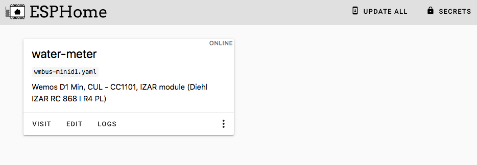

# Wemos D1 Mini + CC1101 (esphome)

[![License][license-shield]][license]
[![ESPHome release][esphome-release-shield]][esphome-release]
[![Open in Visual Studio Code][open-in-vscode-shield]][open-in-vscode]
[![Support author][donate-me-shield]][donate-me]


[license-shield]: https://img.shields.io/static/v1?label=License&message=MIT&color=orange&logo=license
[license]: https://opensource.org/licenses/MIT

[esphome-release-shield]: https://img.shields.io/static/v1?label=ESPHome&message=2023.2.4&color=green&logo=esphome
[esphome-release]: https://GitHub.com/esphome/esphome/releases/

[open-in-vscode-shield]: https://img.shields.io/static/v1?label=+&message=Open+in+VSCode&color=blue&logo=visualstudiocode
[open-in-vscode]: https://open.vscode.dev/zibous/ha-watermeter

[donate-me-shield]: https://img.shields.io/static/v1?label=+&color=orange&message=Buy+me+a+coffee
[donate-me]: https://www.buymeacoff.ee/zibous


### Requirements
- ESPHOME Docker 2023.2.4
- Wemos D1 Mini
- CC1101


After Wemos D1 Mini + CC1101 has been wired, the application can be flashed with ESPHOME

```yaml
## ---------------------------------------------------
## WMBUS DEVICE D1MINI WEMOS
## ---------------------------------------------------
wmbus:
  mosi_pin: GPIO13 #D7  Attached to Hardware SPI controller MOSI
  miso_pin: GPIO12 #D6  Attached to Hardware SPI controller MISO
  clk_pin: GPIO14  #D5  Attached to Hardware SPI controller CLK
  cs_pin: GPIO15   #D8  Controls Boot Mode; Attached to Hardware SPI controller CS
  gdo0_pin: GPIO04 #D2  High Impedance
  gdo2_pin: GPIO05 #D1  High Impedance
```
<hr>

[Wemos D1 Mini + CC1101 configuration see](wmbus-minid1.yaml)


## Workaraound and tips

- Find the watermeterID

  To find the `watermeterId ` you can set the watermeterId to 0 and
  the log_level: "VERBOSE" to find your meterId.

	```yaml
	meter_id: 0 # !secret watermeterId see line 12 wmbus-minid1.yaml
	```

- External components

  Use latest ESPHome with external components from Szczepan's esphome custom components, add this to your .yaml definition:

  ```
    external_components:
     - source: github://SzczepanLeon/esphome-components@main
  ```

  To use the local components from Szczepan's esphome custom components   use:

  ```yaml
	external_components:
	  - source:
	      type: local
	      path: custom_components
	    components: [wmbus]
  ```
 
<br>

## Tools

The easiest way to use the Wemos D1 Mini + CC1101 To create mini is to use ESPHOME as a docker application.

### DOCKER - Install ESPHOME

```bash
#!/bin/bash
# ---------------------------------------------
# sudo bash esphome.sh
# see: https://hub.docker.com/r/esphome/esphome
# ----------------------------------------------
IDu=$(id -u) # UID
IDg=$(id -g) # GID
CURRENTURL=http://$(hostname)
DOCKER_TIMEZONE=Europe/Berlin

DOCKER_APPSDIR=/apps/
DOCKER_TIMEZONE=Europe/Berlin
DOCKERIMAGE=esphome/esphome:2023.2.4
# DOCKERIMAGE=esphome/esphome:latest
CONTAINERLABEL=esphome
APPSDATA=$PWD${DOCKER_APPSDIR}${CONTAINERLABEL}

echo "Create persistent data folder and log folder"
mkdir -p ${APPSDATA} 2>&1

echo "Try to remove previuos installation..."
docker stop ${CONTAINERLABEL} >/dev/null 2>&1
docker rm ${CONTAINERLABEL} >/dev/null 2>&1

echo "Install Docker container ${CONTAINERLABEL}."
docker run --detach \
  --name ${CONTAINERLABEL} \
  --privileged=true \
  --env TZ=${DOCKER_TIMEZONE} \
  --restart unless-stopped \
  --volume /run/udev:/run/udev \
  --volume /etc/localtime:/etc/localtime:ro \
  --volume ${APPSDATA}/config:/config \
  --network host \
  ${DOCKERIMAGE}

echo "Docker container ${CONTAINERLABEL} ready."
echo "Run WEBGUI: ${CURRENTURL}:6052"
```


## Preparation and creating the application
- Download the esphome config from `https://github.com/zibous/ha-watermeter/releases`
- Copy the files and directories to `/docker/app/esphome/config`
- Start Docker ESPHOME
- Create secrets.yaml based on `template_secrets.yaml` and adjust the entries
- Create and deploy the application to the connected Wemos D1 Mini


## Compile Info

```
INFO Reading configuration /config/water-meter-izar.yaml...
INFO Generating C++ source...
INFO Compiling app...
Processing water-meter-izar (board: d1_mini; framework: arduino; platform: platformio/espressif8266 @ 3.2.0)
--------------------------------------------------------------------------------
Platform Manager: Installing platformio/espressif8266 @ 3.2.0
INFO Installing platformio/espressif8266 @ 3.2.0
Downloading  [####################################]  100%
Unpacking  [####################################]  100%
Platform Manager: espressif8266@3.2.0 has been installed!
INFO espressif8266@3.2.0 has been installed!
Tool Manager: Installing platformio/toolchain-xtensa @ ~2.100300.0
INFO Installing platformio/toolchain-xtensa @ ~2.100300.0
Downloading  [####################################]  100%          
Unpacking  [####################################]  100%          
Tool Manager: toolchain-xtensa@2.100300.220621 has been installed!
INFO toolchain-xtensa@2.100300.220621 has been installed!
Tool Manager: Installing platformio/framework-arduinoespressif8266 @ ~3.30002.0
INFO Installing platformio/framework-arduinoespressif8266 @ ~3.30002.0
Downloading  [####################################]  100%          
Unpacking  [####################################]  100%          
Tool Manager: framework-arduinoespressif8266@3.30002.0 has been installed!
INFO framework-arduinoespressif8266@3.30002.0 has been installed!
Tool Manager: Installing platformio/tool-esptool @ <2
INFO Installing platformio/tool-esptool @ <2
Downloading  [####################################]  100%
Unpacking  [####################################]  100%
Tool Manager: tool-esptool@1.413.0 has been installed!
INFO tool-esptool@1.413.0 has been installed!
Tool Manager: Installing platformio/tool-esptoolpy @ ~1.30000.0
INFO Installing platformio/tool-esptoolpy @ ~1.30000.0
Downloading  [####################################]  100%          
Unpacking  [####################################]  100%
Tool Manager: tool-esptoolpy@1.30000.201119 has been installed!
INFO tool-esptoolpy@1.30000.201119 has been installed!
Library Manager: Installing ottowinter/ESPAsyncTCP-esphome @ 1.2.3
INFO Installing ottowinter/ESPAsyncTCP-esphome @ 1.2.3
Downloading  [####################################]  100%
Unpacking  [####################################]  100%
Library Manager: ESPAsyncTCP-esphome@1.2.3 has been installed!
INFO ESPAsyncTCP-esphome@1.2.3 has been installed!
Library Manager: Installing esphome/ESPAsyncWebServer-esphome @ 2.1.0
INFO Installing esphome/ESPAsyncWebServer-esphome @ 2.1.0
Downloading  [####################################]  100%
Unpacking  [####################################]  100%
Library Manager: ESPAsyncWebServer-esphome@2.1.0 has been installed!
INFO ESPAsyncWebServer-esphome@2.1.0 has been installed!
Library Manager: Resolving dependencies...
INFO Resolving dependencies...
Library Manager: Installing bblanchon/ArduinoJson @ 6.18.5
INFO Installing bblanchon/ArduinoJson @ 6.18.5
Downloading  [####################################]  100%
Unpacking  [####################################]  100%
Library Manager: ArduinoJson@6.18.5 has been installed!
INFO ArduinoJson@6.18.5 has been installed!
Library Manager: Installing git+https://github.com/SzczepanLeon/wMbus-lib @ 0.9.15
INFO Installing git+https://github.com/SzczepanLeon/wMbus-lib @ 0.9.15
git version 2.30.2
Cloning into '/config/.esphome/platformio/cache/tmp/pkg-installing-_923diyc'...
Library Manager: wMbus-lib@0.9.15+sha.25dfb37 has been installed!
INFO wMbus-lib@0.9.15+sha.25dfb37 has been installed!
Library Manager: Resolving dependencies...
INFO Resolving dependencies...
Library Manager: Installing lsatan/SmartRC-CC1101-Driver-Lib @ ^2.5.7
INFO Installing lsatan/SmartRC-CC1101-Driver-Lib @ ^2.5.7
Downloading  [####################################]  100%
Unpacking  [####################################]  100%
Library Manager: SmartRC-CC1101-Driver-Lib@2.5.7 has been installed!
INFO SmartRC-CC1101-Driver-Lib@2.5.7 has been installed!
Tool Manager: Installing platformio/tool-scons @ ~4.40400.0
INFO Installing platformio/tool-scons @ ~4.40400.0
Downloading  [####################################]  100%
Unpacking  [####################################]  100%
Tool Manager: tool-scons@4.40400.0 has been installed!
INFO tool-scons@4.40400.0 has been installed!
HARDWARE: ESP8266 80MHz, 80KB RAM, 4MB Flash
LDF: Library Dependency Finder -> https://bit.ly/configure-pio-ldf
Dependency Graph
|-- ESPAsyncTCP-esphome @ 1.2.3
|-- ESPAsyncWebServer-esphome @ 2.1.0
|   |-- ESPAsyncTCP-esphome @ 1.2.3
|   |-- Hash @ 1.0
|   |-- ESP8266WiFi @ 1.0
|-- DNSServer @ 1.1.1
|-- ESP8266WiFi @ 1.0
|-- ESP8266mDNS @ 1.2
|-- ArduinoJson @ 6.18.5
|-- ESP8266HTTPClient @ 1.2
|-- wMbus-lib @ 0.9.15+sha.25dfb37
|   |-- SPI @ 1.0
|   |-- SmartRC-CC1101-Driver-Lib @ 2.5.7
Compiling .pioenvs/water-meter-izar/src/esphome/components....

======================== [SUCCESS] Took 203.35 seconds ========================
INFO Successfully compiled program.
INFO Uploading /config/./build/water-meter-izar/.pioenvs/water-meter-izar/firmware.bin (627776 bytes)
INFO Compressed to 443249 bytes
Uploading: [============================================================] 100% Done...
INFO Waiting for result...
INFO OTA successful
INFO Successfully uploaded program.
```



<br>

### Log
```
14:29:56	[I]	[main:314]	 -------  SET NEW VALUES !!!!!
14:30:05	[I]	[wmbus:054]	Using driver 'izar' for ID [0x43430778] RSSI: -55 dBm T: 1944A511780743434418A241150013CE0766324C94EE48EEF6C8 (26)
14:30:18	[I]	[wmbus:054]	Using driver 'izar' for ID [0x43430778] RSSI: -55 dBm T: 1944A511780743434418A251150013CE10497BE7B53D9135EFCA (26)
14:30:22	[I]	[wmbus:054]	Using driver 'izar' for ID [0x43430778] RSSI: -55 dBm T: 1944A511780743434418A261150013CE2938A11AD749FB58C4CD (26)
14:30:31	[I]	[wmbus:054]	Using driver 'izar' for ID [0x43430778] RSSI: -55 dBm T: 1944A511780743434418A271150013CE3E17E8B1F69A2283DDCF (26)
14:30:49	[I]	[wmbus:054]	Using driver 'izar' for ID [0x43430778] RSSI: -55 dBm T: 1944A511780743434418A211150013CE4CF45D4B3272F6598BC0 (26)
14:30:57	[I]	[wmbus:054]	Using driver 'izar' for ID [0x43430778] RSSI: -55 dBm T: 1944A511780743434418A221150013CE758587B650069C34A0C7 (26)
14:31:05	[I]	[wmbus:054]	Using driver 'izar' for ID [0x43430778] RSSI: -55 dBm T: 1944A511780743434418A231150013CE62AACE1D71D545EFB9C5 (26)
14:31:14	[I]	[wmbus:054]	Using driver 'izar' for ID [0x43430778] RSSI: -55 dBm T: 1944A511780743434418A241150013CE0766324C94EE48EEF6C8 (26)
14:31:22	[I]	[wmbus:054]	Using driver 'izar' for ID [0x43430778] RSSI: -55 dBm T: 1944A511780743434418A251150013CE10497BE7B53D9135EFCA (26)
14:31:31	[I]	[wmbus:054]	Using driver 'izar' for ID [0x43430778] RSSI: -55 dBm T: 1944A511780743434418A261150013CE2938A11AD749FB58C4CD (26)
14:31:39	[I]	[wmbus:054]	Using driver 'izar' for ID [0x43430778] RSSI: -55 dBm T: 1944A511780743434418A271150013CE3E17E8B1F69A2283DDCF (26)
14:31:48	[I]	[wmbus:054]	Using driver 'izar' for ID [0x43430778] RSSI: -55 dBm T: 1944A511780743434418A201150013CE5BDB14E013A12F8292C2 (26)
14:31:57	[I]	[wmbus:054]	Using driver 'izar' for ID [0x43430778] RSSI: -55 dBm T: 1944A511780743434418A211150013CE4CF45D4B3272F6598BC0 (26)
14:32:13	[I]	[wmbus:054]	Using driver 'izar' for ID [0x43430778] RSSI: -55 dBm T: 1944A511780743434418A231150013CE62AACE1D71D545EFB9C5 (26)
14:32:31	[I]	[wmbus:054]	Using driver 'izar' for ID [0x43430778] RSSI: -55 dBm T: 1944A511780743434418A251150013CE13497BE7B53D9135EFCA (26)
.....
```

## Decoded telegram

`1944A511780743434418A241150013CE0766324C94EE48EEF6C8`

```
Auto driver  : izar
Best driver  : unknown 00/00
Using driver : izar 00/00
000   : 19 length (25 bytes)
001   : 44 dll-c (from meter SND_NR)
002   : a511 dll-mfct (DME)
004   : 43434418 dll-id (18444343)
008   : 78 dll-version
009   : 07 dll-type (Water meter)
010   : a2 tpl-ci-field (Mfct specific)
011 C?: 71150013CE3C17E8B1F69A2283DDCF mfct specific

{
    "media":"water",
    "meter":"izar",
    "name":"",
    "id":"18444343",
    "total_m3":451.399,
    "last_month_total_m3":451.114,
    "last_month_measure_date":"2023-02-01",
    "remaining_battery_life_y":10.5,
    "current_alarms":"no_alarm",
    "previous_alarms":"no_alarm",
    "transmit_period_s":8,
    "timestamp":"2023-02-02T13:49:16Z"
}


Using: wmbusmeters: 1.11.0-60-g89c42ab
89c42ab27dc8e7ac566e8b3a7810243a3bebd84b
```

<hr>

## Homeassitant Device


### Update Values HA Service

```yaml
service: esphome.water_meter_set_water_val
data:
  water_val_hour: 0.03
  water_val_day: 0.248
  water_val_yesterday: 0.178
  water_val_week: 0.248
  water_val_month: 1.94
  water_val_year: 14.256
  water_val_lastmonth: 9.59
```

## Tools

### WMBUS - Telegram Decoder
Analyze wmbus or mbus telegrams using wmbusmeters.
Source code https://github.com/weetmuts/wmbusmeters/

The wmbusmeters software acquires utility meter readings through wmbus or plain mbus.
The readings can then be published using MQTT, curled to a REST api,
inserted into a database or stored in a log file. Wiki

This service is identical to running locally: wmbusmeters --analyze=<driver>:<key> <hex>
[Online Telegram Decoder](https://wmbusmeters.org/)


<br>

### ESPHome-Flasher
ESPHome-Flasher is a utility app for the ESPHome framework and is designed to make flashing ESPs with ESPHome as simple as possible by:

    Having pre-built binaries for most operating systems.
    Hiding all non-essential options for flashing. All necessary options for flashing (bootloader, flash mode) are automatically extracted from the binary.

This project was originally intended to be a simple command-line tool, but then I decided that a GUI would be nice. As I don't like writing graphical front end code, the GUI largely is based on the NodeMCU PyFlasher project.
[Self-contained NodeMCU flasher with GUI based on esptool.py and wxPython](https://github.com/marcelstoer/nodemcu-pyflasher)


The flashing process is done using the esptool library by espressif.
[esphome-flasher, a tool to flash ESPs over USB](https://github.com/esphome/esphome-flasher)


### WMBUSMETERS custom components
- [Szczepan's esphome custom components](https://github.com/SzczepanLeon/esphome-components)

### Informations
  
- https://github.com/maciekn/izar-wmbus-esp 
- https://github.com/MariuszWoszczynski/ESPhome-IZAR-meter-reader

