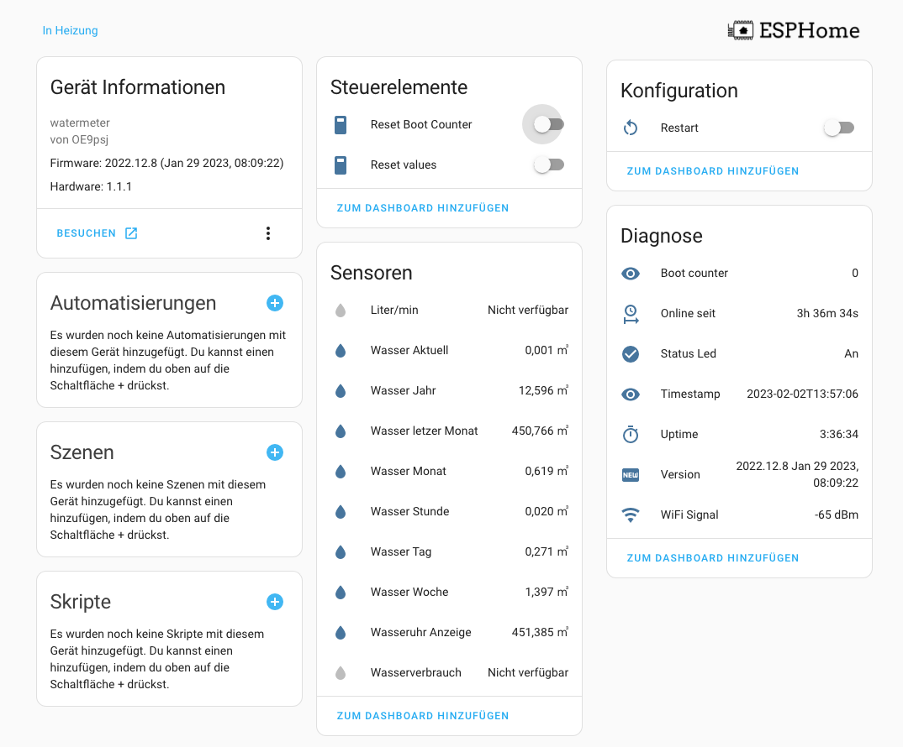

#Wemos D1 Mini, CUL + CC1101 (esphome)


### Requirements
- ESPHOME Docker
- Wemos D1 Mini
- CC1101


After Wemos D1 Min, CUL + CC1101 has been wired, the application can be flashed with ESPHOME

[Wemos D1 Min, CUL + CC1101 configuration see](wmbus-minid1.yaml)

## Tools

The easiest way to use the D! To create mini is to use ESPHOME as a docker application.

### DOCKER ESPHOME

```bash
#!/bin/bash
# ---------------------------------------------
# sudo bash esphome.sh
# see: https://hub.docker.com/r/esphome/esphome
# ----------------------------------------------
IDu=$(id -u) # UID
IDg=$(id -g) # GID
CURRENTURL=http://$(hostname)
DOCKER_TIMEZONE=Europe/Berlin

DOCKER_APPSDIR=/apps/
DOCKER_TIMEZONE=Europe/Berlin
DOCKERIMAGE=esphome/esphome:latest
CONTAINERLABEL=esphome
APPSDATA=$PWD${DOCKER_APPSDIR}${CONTAINERLABEL}

echo "Create persistent data folder and log folder"
mkdir -p ${APPSDATA} 2>&1

echo "Try to remove previuos installation..."
docker stop ${CONTAINERLABEL} >/dev/null 2>&1
docker rm ${CONTAINERLABEL} >/dev/null 2>&1

echo "Install Docker container ${CONTAINERLABEL}."
docker run --detach \
  --name ${CONTAINERLABEL} \
  --privileged=true \
  --env TZ=${DOCKER_TIMEZONE} \
  --restart unless-stopped \
  --volume /run/udev:/run/udev \
  --volume /etc/localtime:/etc/localtime:ro \
  --volume ${APPSDATA}/config:/config \
  --network host \
  ${DOCKERIMAGE}

echo "Docker container ${CONTAINERLABEL} ready."
echo "Run WEBGUI: ${CURRENTURL}:6052"
```

<hr>

## Homeassitant Device


## Tools
Analyze wmbus or mbus telegrams using wmbusmeters.
[Telegram Decoder]([wmbus-minid1.yaml](https://wmbusmeters.org/))

### WMBUSMETERS custom components
[Szczepan's esphome custom components](https://github.com/SzczepanLeon/esphome-components)
