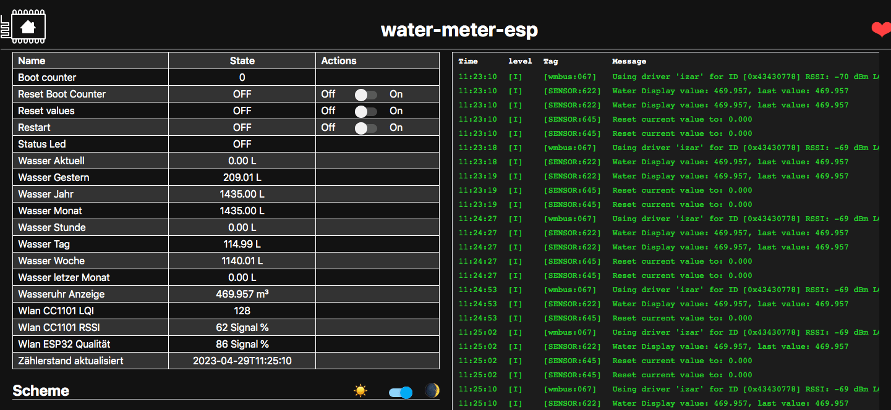
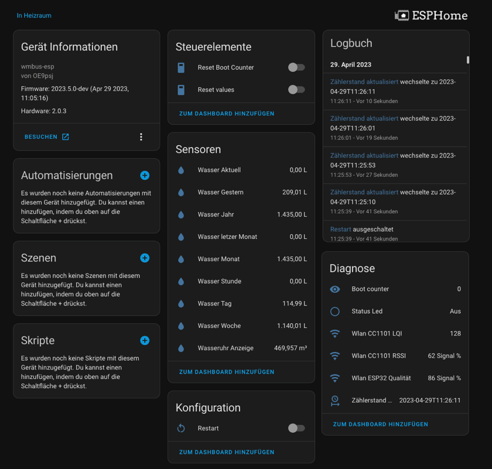
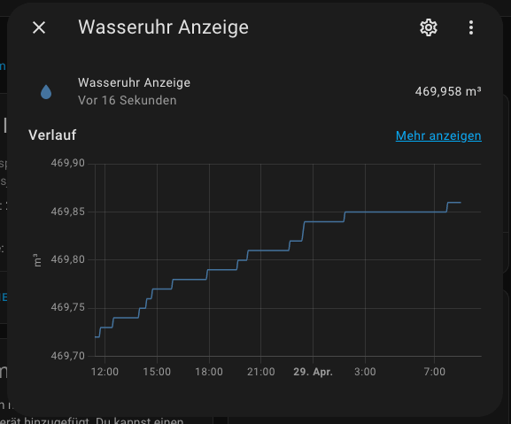
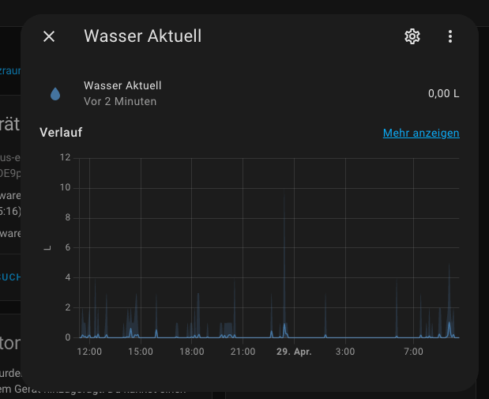
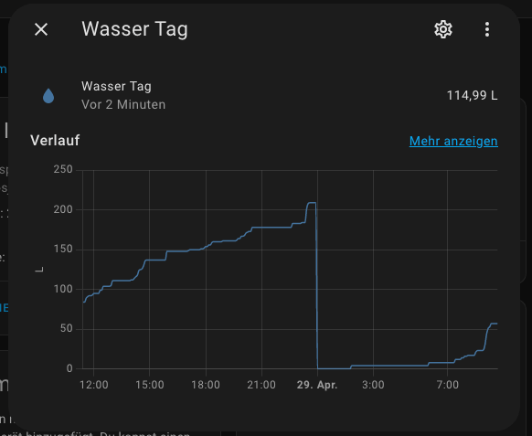
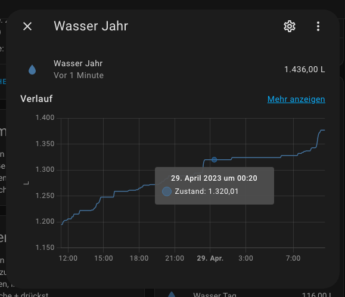
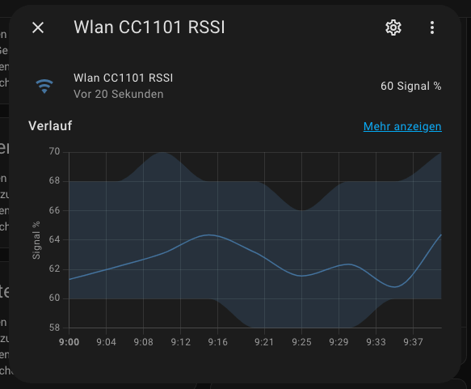
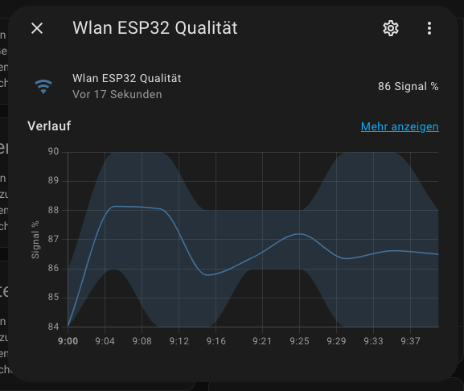

# ESPHome - ESP32 (v4) + CC1101

[![License][license-shield]][license]
[](https://github.com/zibous/ha-watermeter/releases)
[![ESPHome release][esphome-release-shield]][esphome-release]
[![Open in Visual Studio Code][open-in-vscode-shield]][open-in-vscode]
[![Support author][donate-me-shield]][donate-me]


[license-shield]: https://img.shields.io/static/v1?label=License&message=MIT&color=orange&logo=license
[license]: https://opensource.org/licenses/MIT

[esphome-release-shield]: https://img.shields.io/static/v1?label=ESPHome&message=2023.5.0&color=green&logo=esphome
[esphome-release]: https://GitHub.com/esphome/esphome/releases/

[open-in-vscode-shield]: https://img.shields.io/static/v1?label=+&message=Open+in+VSCode&color=blue&logo=visualstudiocode
[open-in-vscode]: https://open.vscode.dev/zibous/ha-watermeter

[donate-me-shield]: https://img.shields.io/static/v1?label=+&color=orange&message=Buy+me+a+coffee
[donate-me]: https://www.buymeacoff.ee/zibous


____

### Requirements
- ESPHOME Docker v2023.5.0-dev
- ESP32 240MHz, 520KB RAM, 4MB Flash (ESP32 AZ-DELIVERY-DEVKIT-V4)
- CC1101 + (optional CC1101 Adapter Platine)


After ESP32 + CC1101 has been wired, the application can be flashed with ESPHOME

```yaml
## ---------------------------------------------------
## WMBUS CC1101 --> ESP32
## ---------------------------------------------------
##
##                                        | 3.3V
##    - - - - - - - - - - - - - - - - - - x
##   |                                    |
## - | 5v           ESP32                 | -- ANT
##   |                                    |
##    - - - - x - x x x x x x - - - - - x x
##                | | | | |             | |
##                | | | | |             | | GND
##           GD00 | | | | |             |
##               GD02                  M0SI
##                   CSN
##                      SCK
##                        MISO
## -------------------------------------------------
wmbus:
  mosi_pin: GPIO23    ## SI:   braun
  miso_pin: GPIO19    ## SO:   grün
  clk_pin: GPIO18     ## SCLK: violett
  cs_pin: GPIO05      ## CSN:  orange
  gdo0_pin: GPIO16    ## GD00: gelb (rx)
  gdo2_pin: GPIO17    ## GD02: weiss (tx)
  
# https://github.com/LSatan/SmartRC-CC1101-Driver-Lib/blob/master/img/Esp32_CC1101.png
```

Configuration see: [ESP32 + CC1101 configuration see](wm-esp32.yaml)


____

### Used components

 - wmbus lib (SzczepanLeon)
    <https://github.com/SzczepanLeon/esphome-components>

 - optional backup (zdzichu6969)
   <https://github.com/zdzichu6969/esphome-components>

 - optional syslog (TheStaticTurtle)
   <https://github.com/TheStaticTurtle/esphome_syslog>

<br>

## Workaraound and tips

- **1st Step**: Find Watermeter ID
  - Install [wm-esp32_test.yaml](wm-esp32_test.yaml)
    To find the `watermeterId ` you can set the watermeterId to 0 and
	 the log_level: "VERBOSE" to find your meterId.
  -  see log messages to find your `watermeterID`
  
-  **2nd Step**: Edit the `secrets.yaml` and change the `watermeterID`
   - Install [wm-esp32.yaml](wm-esp32.yaml)
   - Check log messages 
      
 
  <br>

  > **IMPORTEND**: Be shure that you use the latest version for the build:
  Use **`Clean build files`** before you install the selected esp-home device version. This ensures that the latest components are always used for the application.

<br>

## Tools

The easiest way to use  to create `water-meter-esp + CC1101`  is to use ESPHOME as a docker application.

### DOCKER - Install ESPHOME

```bash
#!/bin/bash
# ---------------------------------------------
# sudo bash esphome.sh
# see: https://hub.docker.com/r/esphome/esphome
# ----------------------------------------------
IDu=$(id -u) # UID
IDg=$(id -g) # GID
CURRENTURL=http://$(hostname)
DOCKER_TIMEZONE=Europe/Berlin

DOCKER_APPSDIR=/apps/
DOCKER_TIMEZONE=Europe/Berlin
DOCKERIMAGE=esphome/esphome:latest
CONTAINERLABEL=esphome
APPSDATA=$PWD${DOCKER_APPSDIR}${CONTAINERLABEL}

echo "Create persistent data folder and log folder"
mkdir -p ${APPSDATA} 2>&1

echo "Try to remove previuos installation..."
docker stop ${CONTAINERLABEL} >/dev/null 2>&1
docker rm ${CONTAINERLABEL} >/dev/null 2>&1

echo "Install Docker container ${CONTAINERLABEL}."
docker run --detach \
  --name ${CONTAINERLABEL} \
  --privileged=true \
  --env TZ=${DOCKER_TIMEZONE} \
  --restart unless-stopped \
  --volume /run/udev:/run/udev \
  --volume /etc/localtime:/etc/localtime:ro \
  --volume ${APPSDATA}/config:/config \
  --network host \
  ${DOCKERIMAGE}

echo "Docker container ${CONTAINERLABEL} ready."
echo "Run WEBGUI: ${CURRENTURL}:6052"
```


## Preparation and creating the application
- Download the esphome config from <https://github.com/zibous/ha-watermeter/releases>
- Copy the files and directories to `/docker/app/esphome/config`
- Start Docker ESPHOME
- Create secrets.yaml based on `template_secrets.yaml` and adjust the entries
- Create and deploy the application to the connected device

## Compile Info

```
INFO Reading configuration /config/wmbus-esp32.yaml...
INFO Generating C++ source...
INFO Backup config will take: 3827 bytes
INFO Compiling app...
Processing water-meter-esp (board: az-delivery-devkit-v4; framework: arduino; platform: platformio/espressif32 @ 5.3.0)
--------------------------------------------------------------------------------
Library Manager: Installing esphome/AsyncTCP-esphome @ 1.2.2
INFO Installing esphome/AsyncTCP-esphome @ 1.2.2
Unpacking  [####################################]  100%
Library Manager: AsyncTCP-esphome@1.2.2 has been installed!
INFO AsyncTCP-esphome@1.2.2 has been installed!
Library Manager: Installing esphome/ESPAsyncWebServer-esphome @ 2.1.0
INFO Installing esphome/ESPAsyncWebServer-esphome @ 2.1.0
Unpacking  [####################################]  100%
Library Manager: ESPAsyncWebServer-esphome@2.1.0 has been installed!
INFO ESPAsyncWebServer-esphome@2.1.0 has been installed!
Library Manager: Resolving dependencies...
INFO Resolving dependencies...
Library Manager: Installing bblanchon/ArduinoJson @ 6.18.5
INFO Installing bblanchon/ArduinoJson @ 6.18.5
Unpacking  [####################################]  100%
Library Manager: ArduinoJson@6.18.5 has been installed!
INFO ArduinoJson@6.18.5 has been installed!
Library Manager: Installing git+https://github.com/SzczepanLeon/wMbus-lib @ 0.9.15
INFO Installing git+https://github.com/SzczepanLeon/wMbus-lib @ 0.9.15
git version 2.30.2
Cloning into '/config/.esphome/platformio/cache/tmp/pkg-installing-vjmtkyyc'...
Library Manager: wMbus-lib@0.9.15+sha.25dfb37 has been installed!
INFO wMbus-lib@0.9.15+sha.25dfb37 has been installed!
Library Manager: Resolving dependencies...
INFO Resolving dependencies...
Library Manager: Installing lsatan/SmartRC-CC1101-Driver-Lib @ ^2.5.7
INFO Installing lsatan/SmartRC-CC1101-Driver-Lib @ ^2.5.7
Unpacking  [####################################]  100%
Library Manager: SmartRC-CC1101-Driver-Lib@2.5.7 has been installed!
INFO SmartRC-CC1101-Driver-Lib@2.5.7 has been installed!
HARDWARE: ESP32 240MHz, 520KB RAM, 4MB Flash
 - toolchain-xtensa-esp32 @ 8.4.0+2021r2-patch5
Library Manager: Installing Syslog @ 2.0.0

Unpacking  [------------------------------------]    0%
Unpacking  [##----------------------------------]    6%
Unpacking  [####--------------------------------]   12%
Unpacking  [######------------------------------]   18%
Unpacking  [#########---------------------------]   25%
Unpacking  [###########-------------------------]   31%
Unpacking  [#############-----------------------]   37%
Unpacking  [###############---------------------]   43%
Unpacking  [##################------------------]   50%
Unpacking  [####################----------------]   56%
Unpacking  [######################--------------]   62%
Unpacking  [########################------------]   68%
Unpacking  [###########################---------]   75%
Unpacking  [#############################-------]   81%
Unpacking  [###############################-----]   87%
Unpacking  [#################################---]   93%
Unpacking  [####################################]  100%
Library Manager: Syslog@2.0.0 has been installed!
Dependency Graph
|-- AsyncTCP-esphome @ 1.2.2
|-- WiFi @ 2.0.0
|-- FS @ 2.0.0
|-- Update @ 2.0.0
|-- ESPAsyncWebServer-esphome @ 2.1.0
|   |-- AsyncTCP-esphome @ 1.2.2
|-- DNSServer @ 2.0.0
|-- ESPmDNS @ 2.0.0
|-- ArduinoJson @ 6.18.5
|-- Syslog @ 2.0.0
|-- WiFiClientSecure @ 2.0.0
|-- HTTPClient @ 2.0.0
|-- wMbus-lib @ 0.9.15+sha.25dfb37
|   |-- SPI @ 2.0.0
|   |-- SmartRC-CC1101-Driver-Lib @ 2.5.7
.....
Building .pioenvs/water-meter-esp/bootloader.bin
Generating partitions .pioenvs/water-meter-esp/partitions.bin
Creating esp32 image...
Successfully created esp32 image.
RAM:   [=         ]   8.3% (used 44420 bytes from 532480 bytes)
Flash: [======    ]  60.1% (used 1103565 bytes from 1835008 bytes)
Building .pioenvs/water-meter-esp/firmware.bin
Creating esp32 image...
Successfully created esp32 image.
esp32_create_combined_bin([".pioenvs/water-meter-esp/firmware.bin"], [".pioenvs/water-meter-esp/firmware.elf"])
Wrote 0x11ed60 bytes to file /config/build/water-meter-esp/.pioenvs/water-meter-esp/firmware-factory.bin, ready to flash to offset 0x0
```


<br>

### Log
```
INFO Reading configuration /config/wmbus-esp32.yaml...
INFO Starting log output from water-meter-esp.siebler.home using esphome API
INFO Successfully connected to water-meter-esp.siebler.home
[13:35:28][I][app:102]: ESPHome version 2023.5.0-dev compiled on Apr 22 2023, 18:53:35
[13:35:28][I][app:104]: Project OE9psj.wmbus-esp version 1.1.7
[13:35:29][I][wmbus:071]: Using driver 'izar' for ID [0x43430778] RSSI: -78 dBm LQI: 128 T: 1944A511780743434418A201150013CEC91E15E04C522E8292C4 (26)
[13:35:29][I][SENSOR:609]: Water Display value: 468.695, last value: 468.695
[13:35:29][I][SENSOR:643]: Reset current value to: 0.000
[13:35:46][I][wmbus:071]: Using driver 'izar' for ID [0x43430778] RSSI: -76 dBm LQI: 140 T: 1944A511780743434418A221150013CEE74086B60FF59D34A0C1 (26)
[13:35:46][I][SENSOR:609]: Water Display value: 468.695, last value: 468.695
[13:35:46][I][SENSOR:643]: Reset current value to: 0.000
[13:35:54][I][wmbus:071]: Using driver 'izar' for ID [0x43430778] RSSI: -77 dBm LQI: 129 T: 1944A511780743434418A231150013CEF06FCF1D2E2644EFB9C3 (26)
[13:35:54][I][SENSOR:609]: Water Display value: 468.695, last value: 468.695
[13:35:54][I][SENSOR:643]: Reset current value to: 0.000
.....
```

<br>

## Decode telegram

Analyze wmbus or mbus telegrams using wmbusmeters.
Source code https://github.com/weetmuts/wmbusmeters/

The wmbusmeters software acquires utility meter readings through wmbus or plain mbus.
The readings can then be published using MQTT, curled to a REST api,
inserted into a database or stored in a log file

This service is identical to running locally: wmbusmeters --analyze=<driver>:<key> <hex>

### Testcase:
<https://wmbusmeters.org/analyze/1944A511780743434418A241150013CE0766324C94EE48EEF6C8>

### Result

```
Auto driver  : izar
Best driver  : unknown 00/00
Using driver : izar 00/00
000   : 19 length (25 bytes)
001   : 44 dll-c (from meter SND_NR)
002   : a511 dll-mfct (DME)
004   : 43434418 dll-id (18444343)
008   : 78 dll-version
009   : 07 dll-type (Water meter)
010   : a2 tpl-ci-field (Mfct specific)
011 C?: 41150013CE0766324C94EE48EEF6C8 mfct specific

{
    "media":"water",
    "meter":"izar",
    "name":"",
    "id":"18444343",
    "total_m3":451.397,
    "last_month_total_m3":451.114,
    "last_month_measure_date":"2023-02-01",
    "remaining_battery_life_y":10.5,
    "current_alarms":"no_alarm",
    "previous_alarms":"no_alarm",
    "transmit_period_s":8,
    "timestamp":"2023-04-21T07:11:05Z"
}


Using: wmbusmeters: 1.12.0-28-g5e548ce
5e548ce3abadd7b84eca9dad3c4f87839e11c07c
```

<hr>

## Homeassitant Device

</img>
 </img> </img> </img>  </img>  </img></img>


### Update Values with HA Service

With the service development tool you can call every available service in Home Assistant. You can use the following service to reset the history values:

```yaml
service: esphome.water_meter_esp_set_watermeter_esp_data
data:
  water_val_hour: 0.03
  water_val_day: 0.248
  water_val_yesterday: 0.178
  water_val_week: 0.248
  water_val_month: 1.94
  water_val_year: 14.256
  water_val_lastmonth: 9.59
```

## Tools

### WMBUS - Telegram Decoder
Analyze wmbus or mbus telegrams using wmbusmeters.
Source code <https://github.com/weetmuts/wmbusmeters/>

The wmbusmeters software acquires utility meter readings through wmbus or plain mbus.
The readings can then be published using MQTT, curled to a REST api,
inserted into a database or stored in a log file. Wiki

This service is identical to running locally: wmbusmeters --analyze=<driver>:<key> <hex>
[Online Telegram Decoder](https://wmbusmeters.org/)


<br>

### ESPHome-Flasher
ESPHome-Flasher is a utility app for the ESPHome framework and is designed to make flashing ESPs with ESPHome as simple as possible by:

    Having pre-built binaries for most operating systems.
    Hiding all non-essential options for flashing. All necessary options for flashing (bootloader, flash mode) are automatically extracted from the binary.

This project was originally intended to be a simple command-line tool, but then I decided that a GUI would be nice. As I don't like writing graphical front end code, the GUI largely is based on the NodeMCU PyFlasher project.
[Self-contained NodeMCU flasher with GUI based on esptool.py and wxPython](https://github.com/marcelstoer/nodemcu-pyflasher)


The flashing process is done using the esptool library by espressif.
[esphome-flasher, a tool to flash ESPs over USB](https://github.com/esphome/esphome-flasher)


### WMBUSMETERS custom components
- [Szczepan's esphome custom components](https://github.com/SzczepanLeon/esphome-components)
- [izar-wmbus-esp (maciekn)](https://github.com/maciekn/izar-wmbus-esp)
- [ESPhome-IZAR-meter-reader (MariuszWoszczynski)](https://github.com/MariuszWoszczynski/ESPhome-IZAR-meter-reader)

### Informations

- SmartRC-CC1101-Driver-Lib: <https://github.com/LSatan/SmartRC-CC1101-Driver-Lib>

- CC1101 Adapter Platine: <https://oshpark.com/shared_projects/dVZXCMXP>