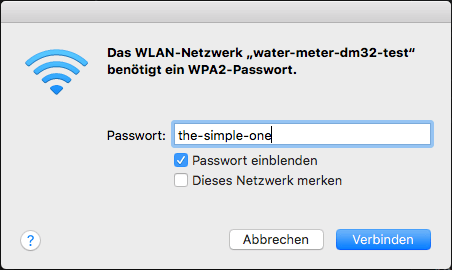

# Testcases Watermeter Firmware

## How to flash the test firmware

1. Select the firmware for your device and download the firmeware
2. Connect your device to the USB 
3. Start ESPHome-Flasher is a utility app or the ESP WEB Flash Tool (chrome browser)

   You can use the following Software to transfer the firmware to the device:
    - > ESPHOME Flasher: https://github.com/esphome/esphome-flasher/releases
    - > ESP Web Tools: https://esphome.github.io/esp-web-tools/
4. After flashing restart the device and watch to the logging console

## ESP Web Tools
    - Connect to the device
    - Prepare for first use
    - When finish set the local WIFI and "Visit Device"
    - OTA Update the firmware for your device
    
Do not use upload firmeware, this is not working - only OTA Update will work.

### water-meter-izar-test.bin
- WMBUS METER D1 MINI ESP8266 + CC1101 for Diehl IZAR RC 868 I R4 PL
- HARDWARE: D1 MINI ESP8266 80MHz, 80KB RAM, 4MB Flash

### water-meter-dm32-test.bin
- WMBUS METER D1 MINI 32 + CC1101 for Diehl IZAR RC 868 I R4 PL
- HARDWARE: ESP32 240MHz, 320KB RAM, 4MB Flash

### water-meter-esp32-izar-test.bin
- WMBUS METER az-delivery-devkit-v4 + CC1101 for Diehl IZAR RC 868 I R4 PL
- Hardware: ESP32 240MHz, 520KB RAM, 4MB Flash

## water-meter-esp32-izar-test2.bin
- WMBUS METER ESP32 DEVKIT V1 + CC1101 for Diehl IZAR RC 868 I R4 PL
- HARDWARE: ESP32 240MHz, 320KB RAM, 4MB Flash
- wMbus-lib@1.2.22
- lsatan/SmartRC-CC1101-Driver-Lib @ ^2.5.7
- wmbus-drivers@0.0.0
- ESPHome version 2023.10.0-dev compiled on Sep 21 2023


<br>

## Connect to WIFI - Access Point Mode
The ESP device is prepared as a Wi-Fi access point and create its own network. Connect to the Wi-Fi access point to set your local WIFI.



<br>


### LOGGING w/o CC1101 connected

Simple Log from the device, no CC1101 allready connected.

```
INFO ESPHome 2023.8.3
INFO Reading configuration /config/wm-d1mini32-izar-test.yaml...
INFO Updating https://github.com/SzczepanLeon/esphome-components.git@main
INFO Starting log output from water-meter-dm32-test.local using esphome API
INFO Successfully connected to water-meter-dm32-test.local
[15:14:57][I][app:102]: ESPHome version 2023.8.3 compiled on Sep 14 2023, 15:06:36
[15:14:57][I][app:104]: Project Diehl_IZAR_RC_868.Watermeter-Test version 2.0.8
[15:14:57][C][logger:301]: Logger:
[15:14:57][C][logger:302]:   Level: VERBOSE
[15:14:57][C][logger:303]:   Log Baud Rate: 0
[15:14:57][C][logger:305]:   Hardware UART: UART0
[15:14:57][C][logger:309]:   Level for 'wmbus': VERBOSE
[15:14:57][C][logger:309]:   Level for 'wMBus-lib': VERBOSE
[15:14:57][C][logger:309]:   Level for 'sensor': WARN
[15:14:57][C][logger:309]:   Level for 'sensor.filter': WARN
[15:14:57][C][logger:309]:   Level for 'text_sensor': WARN
[15:14:57][C][logger:309]:   Level for 'api.service': ERROR
[15:14:57][C][logger:309]:   Level for 'json': ERROR
[15:14:57][C][logger:309]:   Level for 'mqtt': WARN
[15:14:57][C][logger:309]:   Level for 'scheduler': ERROR
[15:14:57][C][logger:309]:   Level for 'wifi': WARN
[15:14:57][C][logger:309]:   Level for 'component': ERROR
[15:14:57][C][logger:309]:   Level for 'api': WARN
[15:14:57][C][restart:068]: Restart Switch 'Restart Device'
[15:14:57][C][restart:070]:   Icon: 'mdi:restart'
[15:14:57][C][restart:091]:   Restore Mode: always OFF
[15:14:57][C][safe_mode_switch:068]: Safe Mode Switch 'Restart (Safe Mode)'
[15:14:57][C][safe_mode_switch:070]:   Icon: 'mdi:restart-alert'
[15:14:57][C][safe_mode_switch:091]:   Restore Mode: always OFF
[15:14:57][C][factory_reset.switch:068]: Factory Reset Switch 'Restart factory default'
[15:14:57][C][factory_reset.switch:070]:   Icon: 'mdi:lock-reset'
[15:14:57][C][factory_reset.switch:091]:   Restore Mode: always OFF
[15:14:57][C][captive_portal:088]: Captive Portal:
[15:14:57][C][web_server:161]: Web Server:
[15:14:57][C][web_server:162]:   Address: water-meter-dm32-test.local:80
[15:14:57][C][sntp:053]: SNTP Time:
[15:14:57][C][sntp:054]:   Server 1: '0.at.pool.ntp.org'
[15:14:57][C][sntp:055]:   Server 2: '0.pool.ntp.org'
[15:14:57][C][sntp:056]:   Server 3: ''
[15:14:57][C][sntp:057]:   Timezone: 'CET-1CEST,M3.5.0,M10.5.0/3'
[15:14:57][C][mdns:112]: mDNS:
[15:14:57][C][mdns:113]:   Hostname: water-meter-dm32-test
[15:14:57][V][mdns:114]:   Services:
[15:14:57][V][mdns:116]:   - _esphomelib, _tcp, 6053
[15:14:57][V][mdns:118]:     TXT: version = 2023.8.3
[15:14:57][V][mdns:118]:     TXT: mac = 4022d83cfb64
[15:14:57][V][mdns:118]:     TXT: platform = ESP32
[15:14:57][V][mdns:118]:     TXT: board = wemos_d1_mini32
[15:14:57][V][mdns:118]:     TXT: network = wifi
[15:14:57][V][mdns:118]:     TXT: project_name = Diehl_IZAR_RC_868.Watermeter-Test
[15:14:57][V][mdns:118]:     TXT: project_version = 2.0.8
[15:14:57][V][mdns:116]:   - _http, _tcp, 80
[15:14:57][C][ota:093]: Over-The-Air Updates:
[15:14:57][C][ota:094]:   Address: water-meter-dm32-test.local:3232
[15:14:57][C][ota:097]:   Using Password.
[15:14:57][C][wifi_signal.sensor:009]: WiFi Signal 'Device WLAN RSSI Quality'
[15:14:57][C][wifi_signal.sensor:009]:   Device Class: 'signal_strength'
[15:14:57][C][wifi_signal.sensor:009]:   State Class: 'measurement'
[15:14:57][C][wifi_signal.sensor:009]:   Unit of Measurement: '%'
[15:14:57][C][wifi_signal.sensor:009]:   Accuracy Decimals: 0
[15:14:57][V][wifi_signal.sensor:009]:   Unique ID: '4022d83cfb64-wifisignal'
[15:14:57][C][wmbus:394]: wM-Bus v2.2.29:
[15:14:57][C][wmbus:411]:   CC1101 SPI bus:
[15:14:57][C][wmbus:412]:     MOSI Pin: GPIO23
[15:14:57][C][wmbus:413]:     MISO Pin: GPIO19
[15:14:57][C][wmbus:414]:     CLK Pin:  GPIO18
[15:14:57][C][wmbus:415]:     CS Pin:   GPIO5
[15:14:57][C][wmbus:416]:     GDO0 Pin: GPIO21
[15:14:57][C][wmbus:417]:     GDO2 Pin: GPIO22
[15:14:57][E][wmbus:430]:   Check connection to CC1101!
```

### LOGGING ESP32 with CC1101 connected

```
INFO ESPHome 2023.10.0-dev
INFO Reading configuration /config/wm-esp32-izar-test2.yaml...
INFO Updating https://github.com/SzczepanLeon/esphome-components.git@main
INFO Starting log output from water-meter-esp32-izar-test2.local using esphome API
WARNING Can't connect to ESPHome API for water-meter-esp32-izar-test2.local: Error resolving IP address: [Errno -3] Temporary failure in name resolution (APIConnectionError)
INFO Trying to connect to water-meter-esp32-izar-test2.local in the background
INFO Successfully connected to water-meter-esp32-izar-test2.local
[13:15:40][I][app:102]: ESPHome version 2023.10.0-dev compiled on Sep 21 2023, 12:21:47
[13:15:40][I][app:104]: Project Diehl_IZAR_RC_868.Watermeter-Test version 2.0.8
[13:15:40][C][logger:357]: Logger:
[13:15:40][C][logger:358]:   Level: VERBOSE
[13:15:40][C][logger:359]:   Log Baud Rate: 0
[13:15:40][C][logger:361]:   Hardware UART: UART0
[13:15:40][C][logger:365]:   Level for 'wmbus': VERBOSE
[13:15:40][C][logger:365]:   Level for 'wMBus-lib': VERBOSE
[13:15:40][C][logger:365]:   Level for 'sensor': WARN
[13:15:40][C][logger:365]:   Level for 'sensor.filter': WARN
[13:15:40][C][logger:365]:   Level for 'text_sensor': WARN
[13:15:40][C][logger:365]:   Level for 'api.service': ERROR
[13:15:40][C][logger:365]:   Level for 'json': ERROR
[13:15:40][C][logger:365]:   Level for 'mqtt': WARN
[13:15:40][C][logger:365]:   Level for 'scheduler': ERROR
[13:15:40][C][logger:365]:   Level for 'wifi': WARN
[13:15:40][C][logger:365]:   Level for 'component': ERROR
[13:15:40][C][logger:365]:   Level for 'api': WARN
[13:15:40][C][restart:068]: Restart Switch 'Restart Device'
[13:15:40][C][restart:070]:   Icon: 'mdi:restart'
[13:15:40][C][restart:091]:   Restore Mode: always OFF
[13:15:40][C][safe_mode_switch:068]: Safe Mode Switch 'Restart (Safe Mode)'
[13:15:40][C][safe_mode_switch:070]:   Icon: 'mdi:restart-alert'
[13:15:40][C][safe_mode_switch:091]:   Restore Mode: always OFF
[13:15:40][C][factory_reset.switch:068]: Factory Reset Switch 'Restart factory default'
[13:15:40][C][factory_reset.switch:070]:   Icon: 'mdi:lock-reset'
[13:15:40][C][factory_reset.switch:091]:   Restore Mode: always OFF
[13:15:40][C][version.text_sensor:021]: Version Text Sensor 'ESPHome Version'
[13:15:40][C][version.text_sensor:021]:   Icon: 'mdi:information-box-outline'
[13:15:40][V][version.text_sensor:021]:   Unique ID: 'c8f09ef34794-version'
[13:15:40][C][captive_portal:088]: Captive Portal:
[13:15:40][C][web_server:161]: Web Server:
[13:15:40][C][web_server:162]:   Address: water-meter-esp32-izar-test2.local:80
[13:15:40][C][sntp:053]: SNTP Time:
[13:15:43][D][sntp:078]: Synchronized time: 2023-09-21 13:15:43
[13:15:43][W][system:385]: Synchronized sntp clock
[13:15:50][D][wmbus:184]: Meter ID [0x43410778] RSSI: -78 dBm LQI: 135 Mode: T1 not found in configuration T: 1944A511780741434418A261140013DBC8CF48AB7711031F7B92 (26)
[13:15:59][D][wmbus:184]: Meter ID [0x43410778] RSSI: -77 dBm LQI: 130 Mode: T1 not found in configuration T: 1944A511780741434418A271140013DBDFE0010056C2DAC46290 (26)
```

## Analyze Telegram

> https://wmbusmeters.org/analyze/1944A511780741434418A261140013DBC8CF48AB7711031F7B92

```
telegram=|1944A511780741434418A2_61140013DBC8CF48AB7711031F7B92|

Auto driver  : izar
Best driver  : unknown 00/00
Using driver : izar 00/00
000   : 19 length (25 bytes)
001   : 44 dll-c (from meter SND_NR)
002   : a511 dll-mfct (DME)
004   : 41434418 dll-id (18444341)
008   : 78 dll-version
009   : 07 dll-type (Water meter)
010   : a2 tpl-ci-field (Mfct specific)
011 C?: 61140013DBC8CF48AB7711031F7B92 mfct specific

{
    "media":"water",
    "meter":"izar",
    "name":"",
    "id":"18444341",
    "last_month_total_m3":240.377,
    "remaining_battery_life_y":10,
    "total_m3":243.054,
    "transmit_period_s":8,
    "current_alarms":"no_alarm",
    "last_month_measure_date":"2023-09-01",
    "previous_alarms":"no_alarm",
    "timestamp":"2023-09-21T11:19:14Z"
}


Using: wmbusmeters: 1.14.0-19-g0b852fb
0b852fb420a931984b231eb363a1826091299761
```

