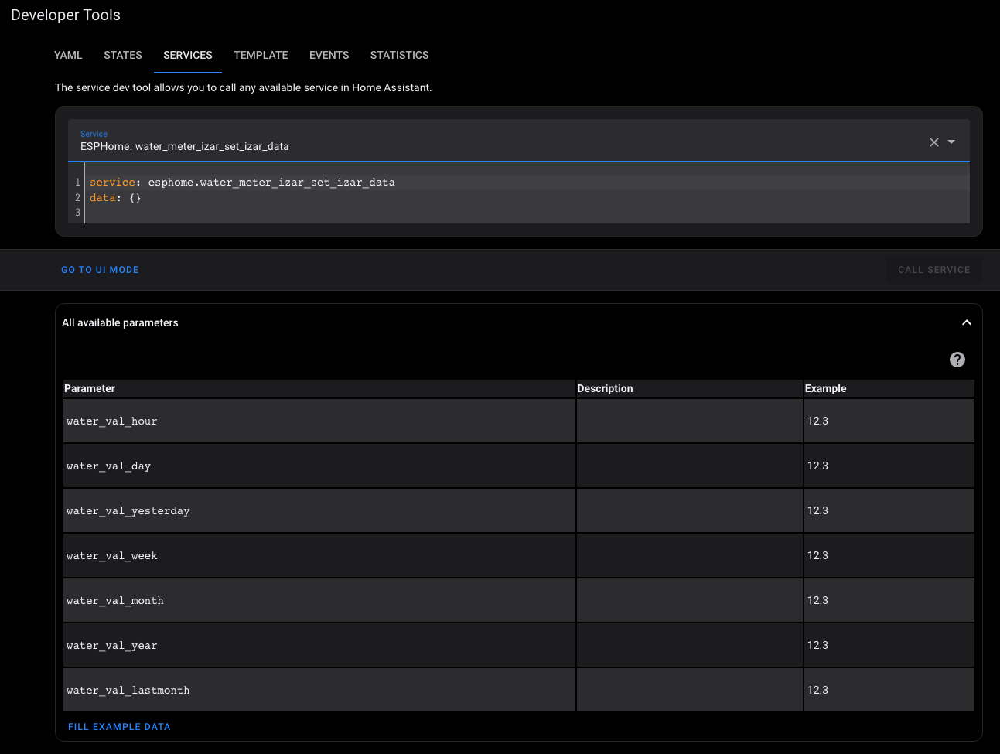

# water-meter-izar

[![License][license-shield]][license]
[![ESPHome release][esphome-release-shield]][esphome-release]
[![Open in Visual Studio Code][open-in-vscode-shield]][open-in-vscode]
[![Support author][donate-me-shield]][donate-me]


[license-shield]: https://img.shields.io/static/v1?label=License&message=MIT&color=orange&logo=license
[license]: https://opensource.org/licenses/MIT

[esphome-release-shield]: https://img.shields.io/static/v1?label=ESPHome&message=v2023.5.0-dev&color=green&logo=esphome
[esphome-release]: https://GitHub.com/esphome/esphome/releases/

[open-in-vscode-shield]: https://img.shields.io/static/v1?label=+&message=Open+in+VSCode&color=blue&logo=visualstudiocode
[open-in-vscode]: https://open.vscode.dev/zibous/ha-watermeter

[donate-me-shield]: https://img.shields.io/static/v1?label=+&color=orange&message=Buy+me+a+coffee
[donate-me]: https://www.buymeacoff.ee/zibous


Watermeter  Wemos D1 Min, CUL - CC1101, IZAR module (Diehl IZAR RC 868 I R4 PL) Developer Version maciekn"

This is a simplified version for IZAR modules (Diehl IZAR RC 868 I R4 PL), but is characterized by a high level of stability, since only the water meter ID and the amount of water consumed are decoded from the telegram.

The remaining data are determined using ESPHOME methods.

## Required components:

    - D1MINI, NodeMCU (however any ESP8266-based device should work fine)
    - CC1101 module (ideally with an antena tuned to 868MHz *)

<br>
> Note: While CC1101 chip is versatile and may by configured programatically to use different frequency, some PCB components has to be selected for better performance. Therefore, please pay attention to get the right one.More info here: https://wiki.fhem.de/wiki/Selbstbau_CUL

<br>


## Wiring ESP8266

CC1101 --> NODEMCI

`ELECHOUSE_cc1101.setSpiPin(14, 12, 13, 15);``

- SCK     -> D5
- MISO    -> D6
- MOSI    -> D7
- CSN     -> D8
- VCC     -> 3V
- GND     -> GND

see: https://github.com/maciekn/izar-wmbus-esp#cc1101-868mhz-pinout


## Used Libraries:

    - SPI
    - izar-wmbus  https://github.com/maciekn/izar-wmbus-esp
    - ArduinoJson https://github.com/bblanchon
    - custom_components/izar_meter.h  
    - syslog https://github.com/TheStaticTurtle/esphome_syslog
    - backup  https://github.com/dentra/esphome-components

<br>

## Maciekn vs. SzczepanLeon

Below is a list to compare the two custom components. At the moment SzczepanLeon's component is my favorite because it provides the most information and is easy and flexible to configure.

| Option                | component.maciekn | component.SzczepanLeon |
| --------------------- | ---|---|
| `Devices` | Only izar |Currently amiplus, apator08, apator162, apatoreitn, bmeters ,elf,evo868, fhkvdataiii, hydrocalm3, itron, izar, mkradio3, mkradio4, qheat, qwater, ultrimis, unismart, vario451 are supported.|
| `Watermeter ID` | Filter by script | Filter by sensor parmeter|
| `Watermeter Key` | No | sensor parameter (key)|
| `Watermeter data`  | Liter (l) | Cubic metre (m³)|
| `Multi Watermeters`  | No | Yes (more than one) |
| `CC1101 Config` | via component (hard coded) | with component.config|
| `Telegram data` | No | Yes |
| `wMBus Gateway`  | no | via TCP or UDP to wmbusmeters (as HEX or rtl-wmbus format or Homeassistant ADDOn) |
| `LED control`  | No | with component.config |
| `CC1101 RSSI, LQI Info` | no | Yes (Using driver 'izar' for ID [0x82720778] RSSI: -36 dBm LQI: 128 T)|
| `Scan Intervall`  | 300ms | device based |
| `Debug Log`  | limited | all important messages: telegram, rssi, lqi, timestamps, configdata |

<br>

## Setup Version `maciekn`:

```
 # my watermeter id
  myWaterMeterID: "add your meter id here"
  
  # log settings
  log_level: "DEBUG" # use VERBOSE mode to find the meterId 0x43430778
  
  # syslog
  syslogserver: add host adress here
  syslogport: "add syslog port here"
  
```

## Device Services

### Homeassistant API


If the device is integrated in the Home Assistant, the error message:

```
  Could not allocate memory for JSON document!
  Requested 184 bytes, largest free heap block: 184 bytes`
```
 
Since this message does not appear without integration in the Home Assistant ***Version Home Assistant 2023.4.5 Frontend 20230411.1 - latest***, it is probably due to the Home Assistant or the ESPHOME API.

So far I haven't found a solution for this, but the message isn't understandable either ?


<br>

**Logger Info:**

```
10:21:10][D][sensor:109]: 'Wasserzähler Anzeige': Sending state 467.45901 m³ with 3 decimals of accuracy
[10:21:10][D][sensor:109]: 'Wasserzähler Anzeige': Sending state 467.45901 m³ with 3 decimals of accuracy
[10:21:10][D][sensor:109]: 'Wasser Aktuell': Sending state 0.00000 L with 2 decimals of accuracy
[10:21:10][D][sensor:109]: 'Wasser Aktuell': Sending state 0.00000 L with 2 decimals of accuracy
[10:21:10][D][DEBUG:637]: Reset current value to: 0.000000
[10:21:10][D][text_sensor:064]: 'Zählerstand aktualisiert': Sending state '2023-04-19T10:21:10'
[10:21:10][E][json:039]: Could not allocate memory for JSON document! Requested 464 bytes, largest free heap block: 464 bytes
[10:21:10][D][SENSOR:649]: New Values: current:0.0, hour: 1.0, day: 60.0, week: 114.0, month: 114.0, lastmonth: 0.0, year: 38.0
[10:21:10][E][json:039]: Could not allocate memory for JSON document! Requested 184 bytes, largest free heap block: 184 bytes
```

#### Homeassistant service call:



```yaml
service: esphome.water_meter_izar_set_izar_data
data:
  water_val_hour: 12.3
  water_val_day: 12.3
  water_val_yesterday: 12.3
  water_val_week: 12.3
  water_val_month: 12.3
  water_val_year: 12.3
  water_val_lastmonth: 12.3
```
<br>

### Backup

Save your ESPHome device configuration in firmware and and recover it if you lost source files. Just download it from `http://water-meter-izar.local/config.yaml``


    WARNING: You should backup your all your files, this solution only for 
             emergency purpose. I am not responsible for the loss or 
             inability to recover data.
             
    WARNING: Stored configuration is the same as shown by esphome config command. 
             It is fully worked but not the same as your original sources.
             
    WARNING: Command line substitutions, custom components and 
             includes are not supported yet!


<br>


### Syslog Messages

```log
tail -f /var/log/syslog | grep water-meter
Apr 19 09:53:02 water-meter-izar text_sensor [D][text_sensor:064]: 'Wasserzähler': Sending state '43430778'
Apr 19 09:53:02 water-meter-izar sensor [D][sensor:109]: 'Wasserzähler gesamt': Sending state 467458.00000 L with 0 decimals of accuracy
Apr 19 09:53:02 water-meter-izar sensor [D][sensor:109]: 'Wasserzähler Anzeige': Sending state 467.45801 m³ with 3 decimals of accuracy
Apr 19 09:53:02 water-meter-izar sensor [D][sensor:109]: 'Wasser Aktuell': Sending state 0.00000 L with 2 decimals of accuracy
Apr 19 09:53:02 water-meter-izar sensor [D][sensor:109]: 'Wasser Aktuell': Sending state 0.00000 L with 2 decimals of accuracy
Apr 19 09:53:02 water-meter-izar text_sensor [D][text_sensor:064]: 'Zählerstand aktualisiert': Sending state '2023-04-19T09:53:02'
Apr 19 09:53:03 water-meter-izar text_sensor [D][text_sensor:064]: 'watermeterdata': Sending state '467458.000|0.000|47.000|59.000|54.000|113.000|113.000|0.000|37.000|2023-04-19T09:52:11'
Apr 19 09:53:06 water-meter-izar sensor [D][sensor:109]: 'Wasser Aktuell': Sending state 0.00000 L with 2 decimals of accuracy
Apr 19 09:53:06 water-meter-izar sensor [D][sensor:109]: 'Wasser Gestern': Sending state 54.00000 L with 2 decimals of accuracy
Apr 19 09:53:11 water-meter-izar sensor [D][sensor:109]: 'Wasser Jahr': Sending state 37.00000 L with 2 decimals of accuracy
Apr 19 09:53:11 water-meter-izar text_sensor [D][text_sensor:064]: 'Timestamp': Sending state '2023-04-19T09:53:11'
Apr 19 09:53:13 water-meter-izar text_sensor [D][text_sensor:064]: 'Zählerstand aktualisiert': Sending state '2023-04-19T09:53:02'
Apr 19 09:53:14 water-meter-izar text_sensor [D][text_sensor:064]: 'Online seit': Sending state '52m 46s'
Apr 19 09:53:15 water-meter-izar sensor [D][sensor:109]: 'Wasser Woche': Sending state 113.00000 L with 2 decimals of accuracy
Apr 19 09:53:16 water-meter-izar sensor [D][sensor:109]: 'Wasserzähler Anzeige': Sending state 467.45801 m³ with 3 decimals of accuracy
Apr 19 09:53:17 water-meter-izar sensor [D][sensor:109]: 'Wlan Signal': Sending state -52.00000 dBm with 0 decimals of accuracy
Apr 19 09:53:17 water-meter-izar sensor [D][sensor:109]: 'Wlan Qualität': Sending state 96.00000 Signal % with 0 decimals of accuracy
Apr 19 09:53:17 water-meter-izar sensor [D][sensor:109]: 'Boot counter': Sending state 0.00000  with 0 decimals of accuracy
Apr 19 09:53:18 water-meter-izar IZAR[WATERMETER] - [D][IZAR WATERMETER:046]: waterUsage: 222063
Apr 19 09:53:18 water-meter-izar IZAR[WATERMETER] - [D][IZAR WATERMETER:056]: watermeterid:  [0x43410778]
Apr 19 09:53:18 water-meter-izar TEXT_SENSOR [D][TEXT_SENSOR:823]: Current Watermeter ID is: 43430778 and has value 467458.000000 Liter
Apr 19 09:53:18 water-meter-izar text_sensor [D][text_sensor:064]: 'Wasserzähler': Sending state '43410778'
Apr 19 09:53:18 water-meter-izar sensor [D][sensor:109]: 'Wasserzähler gesamt': Sending state 222063.00000 L with 0 decimals of accuracy
Apr 19 09:53:18 water-meter-izar SENSOR [I][SENSOR:653]: Watermeter ID: 43410778 and has value 467.5 Liter (222063.0)
Apr 19 09:53:35 water-meter-izar IZAR[WATERMETER] - [D][IZAR WATERMETER:046]: waterUsage: 222063
Apr 19 09:53:35 water-meter-izar IZAR[WATERMETER] - [D][IZAR WATERMETER:056]: watermeterid:  [0x43410778]
Apr 19 09:53:35 water-meter-izar TEXT_SENSOR [D][TEXT_SENSOR:823]: Current Watermeter ID is: 43410778 and has value 222063.000000 Liter
Apr 19 09:53:35 water-meter-izar text_sensor [D][text_sensor:064]: 'Wasserzähler': Sending state '43410778'
Apr 19 09:53:35 water-meter-izar sensor [D][sensor:109]: 'Wasserzähler gesamt': Sending state 222063.00000 L with 0 decimals of accuracy
Apr 19 09:53:36 water-meter-izar IZAR[WATERMETER] - [D][IZAR WATERMETER:046]: waterUsage: 467458
Apr 19 09:53:36 water-meter-izar IZAR[WATERMETER] - [D][IZAR WATERMETER:056]: watermeterid:  [0x43430778]
Apr 19 09:53:36 water-meter-izar TEXT_SENSOR [D][TEXT_SENSOR:823]: Current Watermeter ID is: 43410778 and has value 222063.000000 Liter
Apr 19 09:53:36 water-meter-izar text_sensor [D][text_sensor:064]: 'Wasserzähler': Sending state '43430778'
Apr 19 09:53:36 water-meter-izar sensor [D][sensor:109]: 'Wasserzähler gesamt': Sending state 467458.00000 L with 0 decimals of accuracy
Apr 19 09:53:36 water-meter-izar SENSOR [I][SENSOR:588]: My Watermeter ID: 43430778 and has value 467458.000000 Liter
Apr 19 09:53:36 water-meter-izar sensor [D][sensor:109]: 'Wasser Aktuell': Sending state 0.00000 L with 2 decimals of accuracy
Apr 19 09:53:36 water-meter-izar DEBUG [D][DEBUG:637]: Reset current value to: 0.000000
Apr 19 09:53:36 water-meter-izar SENSOR [D][SENSOR:649]: New Values: current:0.0, hour: 47.0, day: 59.0, week: 113.0, month: 113.0, lastmonth: 0.0, year: 37.0
```
<br>

### Rest Service

Simple query of the data with a CURL command, but can also be done with the help of a REST command in the home assistant or e.g. with a simple Python script.

***Beispiel `CURL` Aufruf:***

```bash
curl -i http://water-meter-izar.local/text_sensor/watermeterdata
HTTP/1.1 200 OK
Content-Length: 229
Content-Type: application/json
Access-Control-Allow-Origin: *
Connection: close
Accept-Ranges: none

{"id":"text_sensor-watermeterdata","value":"467458.000|0.000|47.000|59.000|54.000|113.000|113.000|0.000|37.000|2023-04-19T09:53:11","state":"467458.000|0.000|47.000|59.000|54.000|113.000|113.000|0.000|37.000|2023-04-19T09:53:11"}#
```

## Homeassitant watch reboot device:

With a HA automation I monitor whether an ESPHome device reboots:


```yaml
# -------------------------
  automation:
# -------------------------

    - id: esp_check_bootstate
      alias: Überprüft den Neustart der ESP Geräte
      description: "Wird ausgeführt wenn eines der EPS Geräte neu startet"
      initial_state: true
      trigger:
          - platform: state
            entity_id:
              - sensor.boot_counter
              - sensor.flower_care_boot_counter
              - sensor.heizung_boot_counter
              - sensor.umweltsensor_boot_counter      
      action:
        - service: script.notify_message
          data:
            title: "Watchman"
            message: "ESP Gerät {{ state_attr(trigger.entity_id, 'friendly_name') }} wurde neu gestartet !"
            targetlogger:
              - system
              - gotify
```
