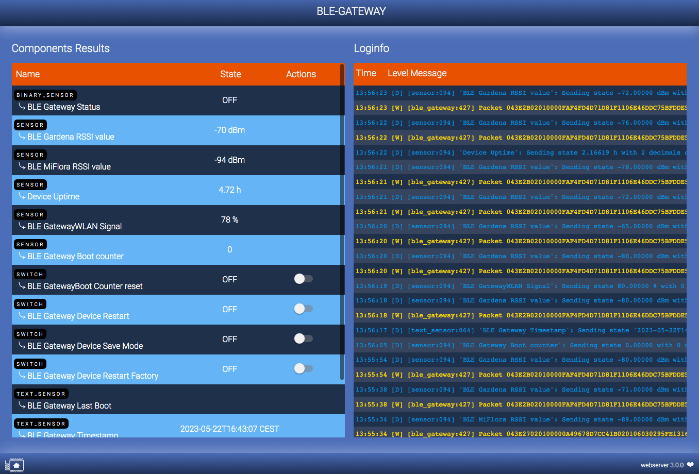
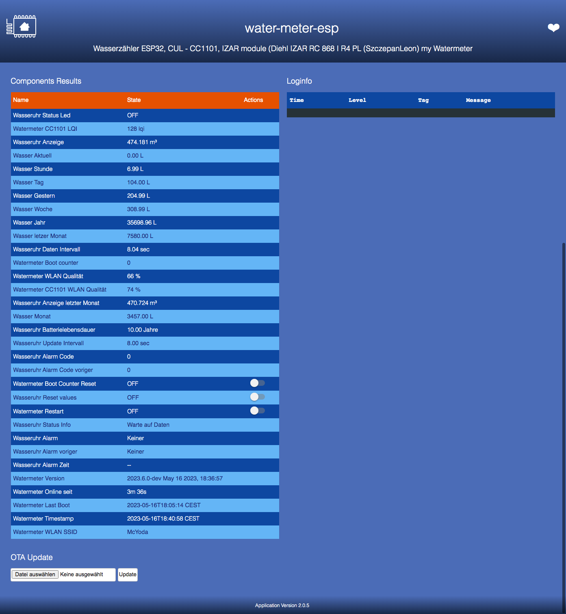

# ESPHOME Webserver

[![License][license-shield]][license]
[](https://github.com/zibous/ha-watermeter/releases)
[![ESPHome release][esphome-release-shield]][esphome-release]
[![Support author][donate-me-shield]][donate-me]

[license-shield]: https://img.shields.io/static/v1?label=License&message=MIT&color=orange&logo=license
[license]: https://opensource.org/licenses/MIT

[esphome-release-shield]: https://img.shields.io/static/v1?label=ESPHome&message=2023.5.0&color=green&logo=esphome
[esphome-release]: https://GitHub.com/esphome/esphome/releases/

[open-in-vscode-shield]: https://img.shields.io/static/v1?label=+&message=Open+in+VSCode&color=blue&logo=visualstudiocode
[open-in-vscode]: https://open.vscode.dev/zibous/ha-watermeter

[donate-me-shield]: https://img.shields.io/static/v1?label=+&color=orange&message=Buy+me+a+coffee
[donate-me]: https://www.buymeacoff.ee/zibous

<br>

The web_server component creates a simple web server on the node that can be accessed through any browser and a simple REST API.
In order to save memory, I don't use the ESP WEBserver, but my own version that I have installed on my server.




> Please note that enabling the component with `local: true` will take up a lot of memory and can lead to problems, especially on the ESP8266.
see: <https://esphome.io/components/web_server.html?highlight=webserver>

<br>

## Made for ESPHome Devices

- **Components Data**
	- Sorted by Component (Binary, Sensor, Switch...)
	- Entries sorted as entered in configuration (yaml).
	- Tooltip (State column) for entity details.
- **Loginfo**
	- Message sorted by Timestamp (last one is on first line).
- **OTA**: Over the air firmware update.

<br>
Requires less memory on the device, since only a simple HTML page is stored there and the application is served from the local server

Unfortunately a little limited, since not all data is published via the API interface. If more came, then a better sorting would be possible. In particular, I'm missing the entity **`ìd`** and some configuration data. I would like more, but it will be a long time before this is done at ESPHome.
<br>

## Configuration

| Version |Configuration |Description |
| --- | ----------- | ----------- |
| Esphome V1 | web_server:<br> port: 80 <br>version: 1.0<br>local: true|  Add css and javascript to memory !  **High memory consumption**  |
| Esphome V1 | web_server:<br> port: 80 <br>version: 1.0<br>local: false |  Loads css and javascript from ESPHOME.io  **Low memory consumption**   |
| Esphome V2 | web_server:<br> port: 80 <br>version: 2.0<br>local: true|  Add css and javascript to memory ! **High memory consumption** |
| Esphome V2 | web_server:<br> port: 80 <br>version: 2.0<br>local: false |  Loads css and javascript from ESPHOME.io.  **Low memory consumption**   |
| **Webserver** Version V1, V2, V3 | web_server:<br> port: 80 <br>version: 2.0<br>js_url: "http://webserver.local/esphome/v2/www.js"|  Loads css and javascript from local webserver. **Low memory consumption**   |


 - **css_url**: The URL that should be used for the CSS stylesheet. Defaults to https://esphome.io/_static/webserver-v1.min.css. This is only for version 1.0 Webserver. Change this to your webserver settings.

 - **js_url** : The URL that should be used for the JS script. Defaults to https://esphome.io/_static/webserver-v1.min.js. Change this to your webserver settings.

<br>

## Installation

1. Copy the web server files from Github to your web server.
2. Change the settings in the ESPHOME application
3. Create the ESPHOME application


## Configuration examples




### Version 1.0


```yaml
## ---------------------------------------------------
## COMPONENT WEBSERVER V1 PRIVATE WEBSERVER
## ---------------------------------------------------
web_server:
  port: 80
  version: 1.0
  js_url: "http://webserver.local/esphome/v3/webserver.js"
  css_url: "http://webserver.local/esphome/v3/webserver.css"
```

### Version 2.0

If you have installed Homeassistant, you can use this as webserver.
Copy the webserver files to `/home/homeassistant/.homeassistant/www/esphome`

Set the webserver v2 url with `secrets.yaml` to  `webserver_jsurl:  "http://homeassistant.local:8123/local/esphome/v2/www.js"`

```yaml
## ---------------------------------------------------
## COMPONENT WEBSERVER V2 PRIVATE WEBSERVER
## ---------------------------------------------------
web_server:
  port: 80
  version: 2.0
  js_url: "http://webserver.local/esphome/v2/www.js"
```


### Version 3.0

```yaml
## ---------------------------------------------------
## COMPONENT WEBSERVER V3 PRIVATE WEBSERVER
## ---------------------------------------------------
web_server:
  port: 80
  version: 2.0
  js_url: "http://webserver.local/esphome/webserver/v3/www.js"
```
